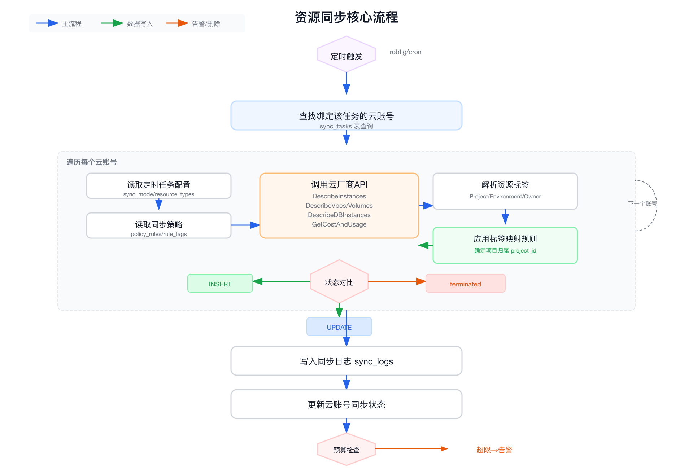
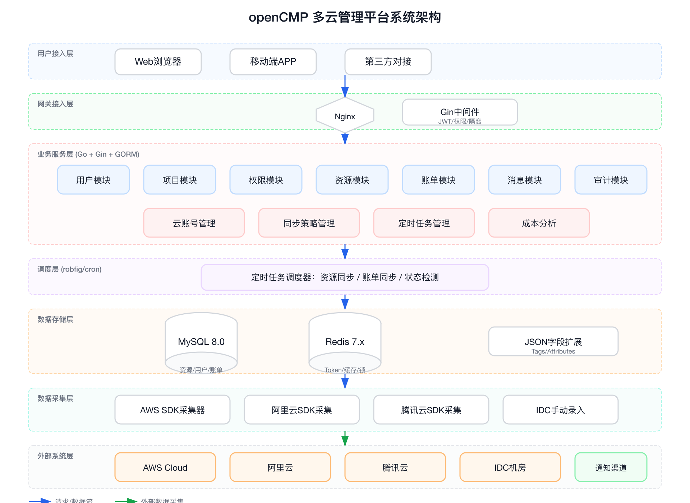
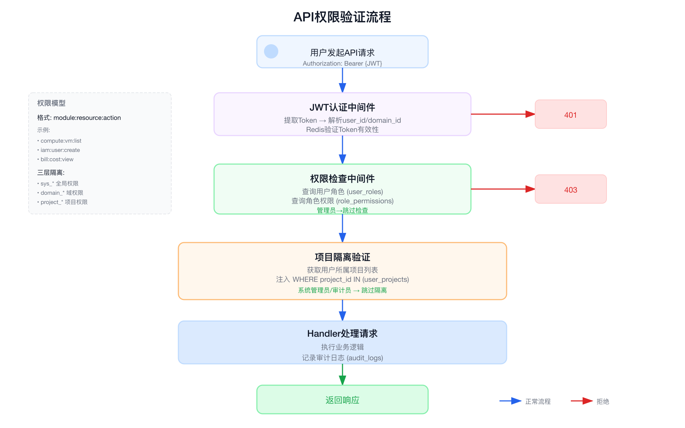

# CMDB平台综合设计文档

> **版本：** v1.0
> **日期：** 2026-04-14
> **状态：** 待评审
> **用途：** 产品立项沟通 + 技术实施指导

---

## 文档导航

| 章节 | 内容 | 适用读者 |
|-----|------|---------|
| 第一章 产品概述 | 产品定位、核心价值、目标用户、资源范围 | **负责人** |
| 第二章 功能设计 | 核心功能模块详解（云账号、资源、账单、项目、消息中心） | **负责人 + 产品** |
| 第三章 核心流程设计 | 资源同步流程、项目归属映射、账单统计逻辑 | **技术团队** |
| 第四章 界面原型 | Dashboard、资源列表、账单等界面示意 | **负责人 + 产品** |
| 第五章 技术架构 | 系统架构、技术选型、数据流 | **技术团队** |
| 第六章 数据模型 | 数据库表设计、ER关系 | **技术团队** |
| 第七章 实施规划 | 开发里程碑、风险点、落地建议 | **负责人 + 技术** |

---

# 第一章 产品概述

## 1.1 产品定位

**企业级多云资源管理平台（CMDB）**，实现 AWS 云平台与 IDC 机房资源的统一管理、账单管理、成本管理、项目归属管理。

**核心价值主张：**

| 价值点 | 解决的问题 | 实现方式 |
|-------|-----------|---------|
| **统一视图** | 资源分散在AWS和IDC，无法统一查看 | 多云资源一站式Dashboard |
| **成本透明** | 账单数据与资源无法关联，成本归属不清 | 账单同步 + 项目归属 + 成本分析 |
| **自动化同步** | 手工维护资源信息，数据不准确 | AWS API自动采集 + 标签映射 |
| **权限隔离** | 不同项目团队数据无隔离 | RBAC + 项目级数据隔离 |
| **预算控制** | 成本超支无预警 | 预算阈值 + 多渠道告警 |

## 1.2 目标用户

| 用户角色 | 主要职责 | 核心需求 | 使用频率 |
|---------|---------|---------|---------|
| **系统管理员** | 平台管理、配置 | 全局权限、系统配置、用户管理 | 低频 |
| **运维工程师** | 资源运维、监控 | 资源详情、状态变更、同步配置 | 高频 |
| **开发人员** | 应用部署、开发 | 项目资源查看、申请流程 | 中频 |
| **财务人员** | 成本核算、预算 | 账单报表、成本分析、预算管理 | 中频 |
| **项目经理** | 项目管理、预算控制 | 项目资源概览、成本预警 | 高频 |

## 1.3 资源管理范围

第一期实现5类资源（按AWS资源细分）：

### 1.3.1 主机资源

| 资源类型 | AWS资源 | 说明 |
|---------|---------|-----|
| 虚拟机 | EC2 Instance | 云服务器实例 |
| 系统镜像 | AMI (Amazon Machine Image) | 系统镜像模板 |
| 安全组 | Security Group | 实例访问控制规则 |
| IP子网 | Subnet | VPC内的IP地址段 |
| 弹性公网IP | EIP (Elastic IP) | 固定公网IP地址 |
| 密钥对 | Key Pair | SSH登录密钥 |

### 1.3.2 网络资源

| 资源类型 | AWS资源 | 说明 |
|---------|---------|-----|
| 区域 | Region | AWS地理区域（如us-east-1） |
| 可用区 | Availability Zone | 区域内的数据中心 |
| VPC | Virtual Private Cloud | 虚拟私有云网络 |
| VPC互联 | VPC Peering | VPC对等连接 |
| 路由表 | Route Table | VPC路由规则 |
| 二层网络 | Subnet | IP子网（同主机中） |
| NAT网关 | NAT Gateway | 网络地址转换网关 |
| DNS | Route53 Hosted Zone | DNS解析服务 |
| 负载均衡 | ELB (Application/Network/Gateway LB) | 负载均衡实例 |
| 证书 | ACM Certificate | SSL/TLS证书 |
| CDN域名 | CloudFront Distribution | CDN加速域名 |

### 1.3.3 存储资源

| 资源类型 | AWS资源 | 说明 |
|---------|---------|-----|
| 块存储 | EBS Volume | 云硬盘存储 |
| 存储桶 | S3 Bucket | 对象存储桶 |

### 1.3.4 数据库资源

| 资源类型 | AWS资源 | 说明 |
|---------|---------|-----|
| RDS实例 | RDS (MySQL/PostgreSQL/Aurora) | 关系型数据库 |
| Redis实例 | ElastiCache Redis | Redis缓存实例 |
| MongoDB实例 | DocumentDB | MongoDB兼容数据库 |

### 1.3.5 中间件资源

| 资源类型 | AWS资源 | 说明 |
|---------|---------|-----|
| Kafka | MSK (Managed Streaming for Kafka) | Kafka消息队列 |
| Elasticsearch | OpenSearch Service | ES搜索服务 |

### 资源归属逻辑

| 来源 | 归属方式 | 说明 |
|-----|---------|-----|
| AWS云资源 | 标签映射策略 | 根据AWS标签自动归属项目 |
| IDC资源 | 手动指定 | 录入时指定所属项目 |

## 1.4 技术架构选型

| 层级 | 技术选型 | 选型理由 |
|-----|---------|---------|
| 前端 | Vue 3 + TypeScript + Element Plus | 企业级UI，组件化开发，TypeScript支持好 |
| 后端 | Go + Gin + GORM | 高性能，并发好，部署简单，ORM完善 |
| 数据库 | MySQL 8.0 | 成熟稳定，支持JSON字段，生态完善 |
| 缓存 | Redis 7.x | Token存储、热点缓存、分布式锁 |
| 定时任务 | robfig/cron | 资源同步、账单同步、状态检测 |
| AWS SDK | aws-sdk-go-v2 | AWS官方Go SDK |
| 通知 | 邮件 + 钉钉/企微/Slack Webhook | 多渠道成本预警 |

---

# 第二章 功能设计

## 2.1 云账号管理模块

### 功能概述

管理多个AWS账号，每个云账号需绑定一个同步策略和一个定时任务，监控同步状态，查看同步日志。

### 核心关系

```
┌─────────────────────────────────────────────────────────────────┐
│              云账号 - 同步策略 - 定时任务 关系图                   │
├─────────────────────────────────────────────────────────────────┤
│                                                                 │
│  ┌─────────────────┐                                            │
│  │  同步策略管理    │ ←── 独立管理，定义资源归属规则               │
│  │  (sync_policy)  │                                            │
│  └─────────────────┘                                            │
│         │                                                       │
│         │ 绑定                                                   │
│         ▼                                                       │
│  ┌─────────────────┐     ┌─────────────────┐                    │
│  │   云账号管理     │ ←── │  定时任务管理    │ ←── 独立管理        │
│  │ (cloud_account) │     │  (sync_task)    │    定义同步频率      │
│  └─────────────────┘     └─────────────────┘                    │
│         │                   │                                   │
│         │ 绑定               │                                   │
│         ▼                   │                                   │
│  ┌─────────────────┐       │                                   │
│  │   同步日志       │ ←─────┴─── 每次执行记录                    │
│  │  (sync_log)     │                                            │
│  └─────────────────┘                                            │
│                                                                 │
└─────────────────────────────────────────────────────────────────┘
```

**关系说明**：
- **同步策略**：独立创建和管理，定义标签映射规则（如何将云资源归属到项目）
- **定时任务**：独立创建和管理，定义同步模式、频率、资源类型
- **云账号**：创建时需绑定一个同步策略和一个定时任务

### 核心功能

| 功能 | 说明 |
|-----|------|
| **账号添加** | 添加AWS账号，配置认证信息，绑定同步策略和定时任务 |
| **账号状态管理** | 启用/禁用账号，禁用后停止同步 |
| **绑定策略/任务** | 每个账号绑定一个同步策略和一个定时任务 |
| **同步状态监控** | 查看上次同步时间、同步资源数、耗时、同步结果 |
| **手动触发同步** | 立即执行一次同步任务 |
| **同步日志查看** | 查看每次同步的详细日志 |

### 云账号信息结构

| 字段 | 说明 |
|-----|------|
| 账号名称 | 用户自定义名称（如：生产账号、测试账号） |
| AWS账号ID | AWS 12位账号ID |
| 认证方式 | Access Key 或 IAM Role ARN |
| **绑定同步策略** | 下拉选择已创建的同步策略 |
| **绑定定时任务** | 下拉选择已创建的定时任务 |
| 启用状态 | 启用/禁用，禁用后不执行同步任务 |
| 同步状态 | success/failed/running，上次同步结果 |
| 上次同步时间 | 最近一次同步完成时间 |
| 同步资源数 | 上次同步的资源总数 |
| 同步耗时 | 上次同步执行时间（秒） |

---

## 2.2 同步策略管理模块

### 功能概述

独立管理同步策略，定义云资源如何归属到本地项目。每个策略支持配置多条规则，每个规则可配置多个标签和匹配条件。

### 核心关系

```
┌─────────────────────────────────────────────────────────────────┐
│                    同步策略 - 规则 - 标签 关系图                   │
├─────────────────────────────────────────────────────────────────┤
│                                                                 │
│  ┌───────────────────────────────────────────────────────────┐ │
│  │                    同步策略 (sync_policy)                  │ │
│  │  - 一个策略包含多条规则                                     │ │
│  │  - 一个云账号只能绑定一个策略                               │ │
│  └───────────────────────────────────────────────────────────┘ │
│         │                                                       │
│         │ 包含                                                   │
│         ▼                                                       │
│  ┌───────────────────────────────────────────────────────────┐ │
│  │                    规则 (policy_rule)                      │ │
│  │  - 规则名称                                                 │ │
│  │  - 匹配条件（全部匹配/至少一个/key匹配）                     │ │
│  │  - 目标项目                                                 │ │
│  │  - 优先级                                                   │ │
│  └───────────────────────────────────────────────────────────┘ │
│         │                                                       │
│         │ 包含                                                   │
│         ▼                                                       │
│  ┌───────────────────────────────────────────────────────────┐ │
│  │                    标签条件 (rule_tag)                     │ │
│  │  - 标签键 (tag_key)                                        │ │
│  │  - 标签值 (tag_value)                                      │ │
│  │  - 一个规则可配置多个标签                                   │ │
│  └───────────────────────────────────────────────────────────┘ │
│                                                                 │
└─────────────────────────────────────────────────────────────────┘
```

### 核心功能

| 功能 | 说明 |
|-----|------|
| **策略创建** | 创建同步策略，定义策略名称、描述 |
| **规则配置** | 配置多条规则，每条规则设置匹配条件、标签、目标项目 |
| **策略编辑** | 修改规则配置 |
| **策略启用/禁用** | 启用或禁用策略 |
| **策略复制** | 复制已有策略快速创建新策略 |
| **策略预览** | 预览规则匹配效果 |

### 同步策略信息结构

| 字段 | 说明 |
|-----|------|
| 策略名称 | 策略显示名称（如：生产环境归属策略） |
| 策略描述 | 策略用途说明 |
| 规则列表 | 一组匹配规则（可多条） |
| 启用状态 | 启用/禁用 |
| 创建时间 | 策略创建时间 |
| 绑定账号数 | 使用该策略的云账号数量 |

### 规则匹配条件类型

每条规则需选择一个匹配条件类型：

| 条件类型 | 说明 | 匹配逻辑 |
|---------|------|---------|
| **全部匹配以下标签时** | 资源必须同时满足所有配置的标签 | AND逻辑，所有标签都匹配才归属目标项目 |
| **匹配以下至少一个标签时** | 资源满足任意一个配置的标签即可 | OR逻辑，任意一个标签匹配即归属目标项目 |
| **根据标签key匹配** | 只检查资源是否有指定的标签key，不关心value值 | 只要存在指定key的标签即归属目标项目 |

### 规则信息结构

| 规则字段 | 说明 |
|---------|------|
| 规则名称 | 规则显示名称 |
| 匹配条件 | 全部匹配/至少一个/key匹配 |
| 标签列表 | 配置多个标签（key + value） |
| 目标项目 | 匹配成功后归属的项目 |
| 优先级 | 规则优先级（数字越大越高） |
| 启用状态 | 启用/禁用 |

### 标签条件配置

每个标签条件包含：

| 字段 | 说明 | 示例 |
|-----|------|-----|
| 标签键 | AWS标签的key | Project |
| 标签值 | 标签的value值（key匹配时可为空） | project-alpha |

### 规则匹配逻辑

```
┌─────────────────────────────────────────────────────────────────┐
│                    规则匹配逻辑流程                               │
├─────────────────────────────────────────────────────────────────┤
│                                                                 │
│  [1] 获取云资源的所有标签                                        │
│       │  Tags: {                                                │
│       │    "Project": "project-alpha-prod",                     │
│       │    "Environment": "production",                         │
│       │    "CostCenter": "cc-001"                               │
│       │  }                                                      │
│       ▼                                                         │
│  [2] 按优先级遍历策略中的所有规则                                 │
│       │                                                         │
│       ▼                                                         │
│  [3] 检查规则的匹配条件类型                                       │
│       │                                                         │
│       ├─ 全部匹配以下标签时：                                    │
│       │    检查资源是否同时满足所有配置的标签                     │
│       │    示例：规则配置了 Project=alpha, Environment=prod     │
│       │    资源必须有这两个标签且值匹配才成功                     │
│       │                                                         │
│       ├─ 匹配以下至少一个标签时：                                │
│       │    检查资源是否满足任意一个配置的标签                     │
│       │    示例：规则配置了 Project=alpha, CostCenter=001       │
│       │    资源只要有其中一个标签值匹配即成功                     │
│       │                                                         │
│       ├─ 根据标签key匹配：                                       │
│       │    只检查资源是否有配置的标签key                         │
│       │    示例：规则配置了标签key=Project                       │
│       │    资源只要有Project这个标签即成功（不关心值）            │
│       │                                                         │
│       ▼                                                         │
│  [4] 匹配成功 → 归属目标项目                                     │
│       │  未匹配 → 继续检查下一规则                               │
│       │                                                         │
│       ▼                                                         │
│  [5] 所有规则都不匹配 → 归属默认项目                             │
│                                                                 │
└─────────────────────────────────────────────────────────────────┘
```

### 策略配置示例

**示例策略：生产环境归属策略**

| 规则名称 | 匹配条件 | 标签配置 | 目标项目 | 优先级 |
|---------|---------|---------|---------|-------|
| Alpha项目规则 | 全部匹配以下标签时 | Project=project-alpha, Environment=prod | 项目Alpha | 100 |
| Beta项目规则 | 全部匹配以下标签时 | Project=project-beta, Environment=prod | 项目Beta | 100 |
| 成本中心规则 | 匹配以下至少一个标签时 | CostCenter=cc-001, CostCenter=cc-002 | 项目Alpha | 80 |
| 有Project标签的 | 根据标签key匹配 | Project（任意值） | 默认项目 | 50 |
| 无标签资源 | - | - | 默认项目 | 1 |

---

## 2.3 定时任务管理模块

### 功能概述

独立管理定时任务，定义同步任务的执行方式。每个云账号绑定一个定时任务。

### 核心关系

```
┌─────────────────────────────────────────────────────────────────┐
│                    定时任务 - 云账号 关系图                        │
├─────────────────────────────────────────────────────────────────┤
│                                                                 │
│  ┌───────────────────────────────────────────────────────────┐ │
│  │                    定时任务 (sync_task)                    │ │
│  │  - 任务类型：同步云账号                                     │ │
│  │  - 触发频率：单次/每天/每周/每月/周期                        │ │
│  │  - 有效期：开始日期 - 结束日期                               │ │
│  └───────────────────────────────────────────────────────────┘ │
│         │                                                       │
│         │ 绑定                                                   │
│         ▼                                                       │
│  ┌───────────────────────────────────────────────────────────┐ │
│  │                    云账号 (cloud_account)                  │ │
│  │  - 一个云账号绑定一个定时任务                               │ │
│  │  - 任务到期后不再执行                                       │ │
│  └───────────────────────────────────────────────────────────┘ │
│                                                                 │
└─────────────────────────────────────────────────────────────────┘
```

### 核心功能

| 功能 | 说明 |
|-----|------|
| **任务创建** | 创建定时任务，定义任务类型、触发频率、有效期 |
| **任务编辑** | 修改任务配置 |
| **任务启用/禁用** | 启用或禁用任务 |
| **手动执行** | 立即执行一次任务 |
| **执行历史查看** | 查看任务执行记录 |

### 定时任务信息结构

| 字段 | 说明 |
|-----|------|
| 任务名称 | 任务显示名称（如：生产账号每日同步） |
| **任务类型** | 同步云账号（资源同步任务） |
| **触发频率** | 单次/每天/每周/每月/周期 |
| **有效期** | 开始日期 - 结束日期（到期后不再执行） |
| 同步模式 | 增量同步/全量同步 |
| 同步资源类型 | 选择要同步的资源类型 |
| 启用状态 | 启用/禁用 |
| 创建时间 | 任务创建时间 |
| 绑定账号数 | 绑定的云账号数量 |

### 任务类型

| 类型 | 说明 |
|-----|------|
| **同步云账号** | 从AWS账号同步资源数据到本地 |

### 触发频率类型

| 频率类型 | 说明 | 配置参数 |
|---------|------|---------|
| **单次** | 只执行一次，执行后自动禁用 | 执行时间（具体日期时间） |
| **每天** | 每天固定时间执行 | 执行时间（如：02:00） |
| **每周** | 每周固定日期和时间执行 | 星期几 + 执行时间（如：周一 02:00） |
| **每月** | 每月固定日期和时间执行 | 日期 + 执行时间（如：每月1号 02:00） |
| **周期** | 自定义周期执行 | Cron表达式 |

### 触发频率配置详情

**单次执行**：
| 配置项 | 说明 | 示例 |
|-------|------|-----|
| 执行日期 | 选择具体日期 | 2026-04-15 |
| 执行时间 | 选择具体时间 | 14:00 |

**每天执行**：
| 配置项 | 说明 | 示例 |
|-------|------|-----|
| 执行时间 | 每天执行的时间点 | 02:00 |

**每周执行**：
| 配置项 | 说明 | 示例 |
|-------|------|-----|
| 星期几 | 选择哪几天执行 | 周一、周三、周五 |
| 执行时间 | 执行的时间点 | 02:00 |

**每月执行**：
| 配置项 | 说明 | 示例 |
|-------|------|-----|
| 日期 | 每月哪几天执行 | 1号、15号 |
| 执行时间 | 执行的时间点 | 02:00 |

**周期执行（自定义）**：
| 配置项 | 说明 | 示例 |
|-------|------|-----|
| Cron表达式 | 自定义执行周期 | 0 */2 * * *（每2小时） |

### 有效期设置

| 配置项 | 说明 |
|-------|------|
| 开始日期 | 任务开始执行的日期 |
| 结束日期 | 任务停止执行的日期（到期后不再触发） |

**有效期逻辑**：
- 当前日期 < 开始日期：任务处于"待生效"状态，不执行
- 开始日期 ≤ 当前日期 ≤ 结束日期：任务正常执行
- 当前日期 > 结束日期：任务处于"已过期"状态，不再执行

### 同步模式

| 模式 | 说明 |
|-----|------|
| **增量同步** | 只同步新增资源，不更新已有资源状态 |
| **全量同步** | 同步所有资源，确保本地与云平台状态一致 |

### 同步资源类型选择

| 类型 | 说明 |
|-----|------|
| 主机 | EC2、AMI、安全组、子网、EIP、密钥 |
| 网络 | VPC、路由表、NAT网关、ELB、证书、CDN |
| 存储 | EBS、S3 |
| 数据库 | RDS、Redis、MongoDB |
| 中间件 | Kafka、Elasticsearch |
| 全部 | 所有资源类型 |

### 定时任务示例

**示例1：每日全量同步**
| 字段 | 值 |
|-----|------|
| 任务名称 | 生产账号每日全量同步 |
| 任务类型 | 同步云账号 |
| 触发频率 | 每天 |
| 执行时间 | 02:00 |
| 开始日期 | 2026-04-01 |
| 结束日期 | 2026-12-31 |
| 同步模式 | 全量同步 |
| 同步资源类型 | 全部 |

**示例2：每周增量同步**
| 字段 | 值 |
|-----|------|
| 任务名称 | 测试账号每周增量同步 |
| 任务类型 | 同步云账号 |
| 触发频率 | 每周 |
| 星期几 | 周一、周三、周五 |
| 执行时间 | 08:00 |
| 开始日期 | 2026-04-01 |
| 结束日期 | 2026-06-30 |
| 同步模式 | 增量同步 |
| 同步资源类型 | 主机、数据库 |

**示例3：单次同步**
| 字段 | 值 |
|-----|------|
| 任务名称 | 新账号初始化同步 |
| 任务类型 | 同步云账号 |
| 触发频率 | 单次 |
| 执行日期 | 2026-04-15 |
| 执行时间 | 10:00 |
| 开始日期 | 2026-04-15 |
| 结束日期 | 2026-04-15 |
| 同步模式 | 全量同步 |
| 同步资源类型 | 全部 |
|-----|------|
| 任务名称 | 任务显示名称（如：每日全量同步） |
| 同步模式 | 增量同步/全量同步 |
| 执行频率 | Cron表达式或预设频率 |
| 同步资源类型 | 选择要同步的资源类型 |
| 启用状态 | 启用/禁用 |
| 创建时间 | 任务创建时间 |
| 绑定账号数 | 使用该任务的云账号数量 |

### 同步模式说明

| 模式 | 行为 | 适用场景 |
|-----|------|---------|
| **增量同步** | 只记录新增资源，不更新已删除/停止的资源状态 | 快速同步、监控新资源 |
| **全量同步** | 本地数据与云平台完全同步，删除的资源标记为terminated | 确保数据一致性 |

### 执行频率配置

| 预设频率 | Cron表达式 | 说明 |
|---------|----------|------|
| 每小时 | 0 * * * * | 每小时整点执行 |
| 每30分钟 | */30 * * * * | 每30分钟执行 |
| 每天02:00 | 0 2 * * * | 每天凌晨2点 |
| 每天06:00 | 0 6 * * * | 每天早上6点 |
| 自定义 | 用户输入Cron | 自定义执行时间 |

### 同步资源类型选择

| 类型 | 说明 | AWS资源 |
|-----|------|---------|
| 主机 | EC2、AMI、安全组、子网、EIP、密钥 | ✓ |
| 网络 | VPC、路由表、NAT网关、ELB、证书、CDN | ✓ |
| 存储 | EBS、S3 | ✓ |
| 数据库 | RDS、Redis、MongoDB | ✓ |
| 中间件 | Kafka、Elasticsearch | ✓ |
| 全部 | 所有资源类型 | ✓ |

**资源类型可多选**，默认选择"全部"。

---

## 2.4 同步日志管理

### 功能概述

记录每次同步任务的执行结果，支持按账号、时间、状态筛选查看。

### 核心功能

| 功能 | 说明 |
|-----|------|
| **日志列表** | 查看所有同步执行记录 |
| **按账号筛选** | 筛选指定云账号的日志 |
| **按时间筛选** | 筛选指定时间范围的日志 |
| **按状态筛选** | 筛选成功/失败的日志 |
| **日志详情** | 查看单次同步的详细信息 |
| **失败分析** | 查看失败原因和错误信息 |

### 同步日志信息结构

| 字段 | 说明 |
|-----|------|
| 云账号 | 执行同步的云账号名称 |
| 定时任务 | 执行的任务名称 |
| 同步策略 | 使用的策略名称 |
| 同步模式 | 增量/全量 |
| 开始时间 | 任务开始时间 |
| 结束时间 | 任务结束时间 |
| 新增资源数 | 本次新增的资源数量 |
| 更新资源数 | 本次更新的资源数量 |
| 删除资源数 | 全量模式下标记删除的资源数 |
| 失败资源数 | 同步失败的资源数 |
| 耗时 | 任务执行时间（秒） |
| 状态 | success/failed |
| 错误信息 | 失败时的错误详情 |

---

## 2.5 资源管理模块

### 功能概述

统一管理 AWS 云账号同步的资源和 IDC 手动录入的资源，支持5大类资源的查看、筛选、详情查看、状态追踪。

### 核心功能

| 功能 | 说明 |
|-----|------|
| **资源大盘** | 按项目/账号/地域/类型多维度展示资源统计 |
| **资源列表** | 按类型展示资源，支持搜索、多维度筛选 |
| **资源详情** | 展示资源配置、网络信息、成本数据、状态历史 |
| **IDC资源录入** | 手动填写IDC机房资源信息 |
| **资源状态追踪** | 记录资源从创建到终止的全生命周期 |
| **资源导出** | 支持导出资源列表为Excel/CSV |

### 资源大盘

资源大盘提供多维度资源统计视图：

| 维度 | 说明 | 展示方式 |
|-----|------|---------|
| **按项目** | 各项目资源数量统计 | 柱状图 + 表格 |
| **按账号** | 各AWS账号资源数量统计 | 柱状图 + 表格 |
| **按地域** | 各Region资源分布 | 地图 + 表格 |
| **按类型** | 各资源类型数量统计 | 饼图 + 表格 |
| **按状态** | running/stopped/terminated统计 | 环形图 |

**大盘筛选功能**：
- 选择维度：项目/账号/地域/类型
- 选择资源类型：主机/网络/存储/数据库/中间件
- 选择状态：全部/running/stopped/terminated

### 资源信息结构

每类资源包含：
- **基本信息**：名称、ID、云账号、项目归属、状态、区域
- **配置信息**：按资源类型不同（详见下表）
- **标签信息**：AWS标签（Project、Environment、Owner等）
- **成本信息**：本月成本、累计成本（仅AWS资源）
- **状态历史**：状态变更记录

### 各资源类型信息字段

**主机资源（EC2）**：

| 字段 | 说明 |
|-----|------|
| 实例ID | i-xxxxxxxx |
| 实例类型 | m5.large等 |
| CPU/内存 | 配置信息 |
| 操作系统 | AMI系统类型 |
| 私网IP | 内网IP地址 |
| 公网IP | EIP地址 |
| 安全组 | 关联的安全组列表 |
| 密钥对 | SSH密钥名称 |
| 所属VPC/Subnet | 网络归属 |
| 状态 | running/stopped/terminated |

**网络资源（VPC/ELB等）**：

| 字段 | 说明 |
|-----|------|
| 资源ID | vpc-xxx/elb-xxx等 |
| CIDR | IP地址段（VPC/Subnet） |
| 关联资源 | 关联的实例数 |
| 区域/可用区 | 地理位置信息 |
| 状态 | active/inactive |

**存储资源（EBS/S3）**：

| 字段 | 说明 |
|-----|------|
| 存储ID | vol-xxx/bucket名称 |
| 容量 | 存储大小（GB） |
| 类型 | gp3/io1/standard等 |
| 关联实例 | EBS挂载的EC2实例 |
| 状态 | in-use/available/deleted |

**数据库资源（RDS/Redis/MongoDB）**：

| 字段 | 说明 |
|-----|------|
| 实例ID | 数据库实例标识 |
| 引擎类型 | MySQL/PostgreSQL/Redis/MongoDB |
| 版本 | 引擎版本 |
| 实例类型 | db.r5.large等 |
| 存储容量 | 数据库存储大小 |
| 连接地址 | 数据库连接endpoint |
| 状态 | available/stopped/deleted |

**中间件资源（Kafka/ES）**：

| 字段 | 说明 |
|-----|------|
| 集群名称 | 集群标识 |
| 版本 | Kafka/ES版本 |
| 节点数 | 集群节点数量 |
| 存储容量 | 总存储大小 |
| 状态 | active/maintenance/deleted |

---

## 2.6 项目管理模块

### 功能概述

管理项目信息、项目管理员、项目成员、项目预算、项目资源统计。

### 核心功能

| 功能 | 说明 |
|-----|------|
| **项目创建** | 创建项目，设置项目名称、代码、管理员、备注 |
| **项目管理员配置** | 指定项目管理员（可多人），拥有本项目全权限 |
| **项目成员管理** | 添加/移除项目成员，分配角色 |
| **项目资源查看** | 查看项目下所有资源列表，支持按类型筛选 |
| **项目成本汇总** | 项目月度成本汇总，预算执行进度 |
| **项目预算配置** | 设置项目预算金额、告警阈值 |

### 项目信息结构

| 字段 | 说明 |
|-----|------|
| 项目名称 | 项目显示名称 |
| 项目代码 | 项目唯一标识（如：project-alpha） |
| 项目管理员 | 项目负责人列表（可多人） |
| 项目备注 | 项目描述信息 |
| 成员数 | 项目成员数量 |
| 资源数 | 项目下资源总数 |
| 月预算 | 项目月度预算金额 |
| 本月消费 | 本月累计成本 |

### 项目资源列表

点击"资源列表"按钮，展示项目下所有资源：

| 展示内容 | 说明 |
|---------|------|
| 资源类型分布 | 各类型资源数量统计 |
| 资源列表 | 按类型分组展示所有资源 |
| 状态分布 | running/stopped/terminated统计 |
| 成本汇总 | 项目总成本、各类型成本 |

---

## 2.7 账单管理模块

### 功能概述

从AWS Cost Explorer API同步账单数据，支持多维度统计：按项目、按账号、按服务、按资源。

### 核心功能

| 功能 | 说明 |
|-----|------|
| **账单同步** | 每天自动同步AWS账单数据（支持多账号） |
| **按项目统计** | 各项目月度成本汇总，支持项目对比 |
| **按账号统计** | 各AWS账号月度成本汇总 |
| **按服务统计** | EC2/RDS/S3等各服务成本占比 |
| **按资源统计** | 单个资源成本明细，Top N资源排行 |
| **成本趋势** | 近6个月成本趋势图 |
| **预算执行** | 项目预算执行进度，超限预警 |

### 账单统计维度

**按项目统计**：

| 维度 | 说明 |
|-----|------|
| 项目列表 | 各项目月度成本表格 |
| 成本占比 | 各项目成本饼图 |
| 成本对比 | 项目间成本柱状图对比 |
| 预算进度 | 各项目预算执行进度条 |

**按账号统计**：

| 维度 | 说明 |
|-----|------|
| 账号列表 | 各AWS账号月度成本表格 |
| 成本占比 | 各账号成本饼图 |
| 成本趋势 | 各账号成本趋势对比图 |

**按服务统计**：

| 维度 | 说明 |
|-----|------|
| 服务列表 | EC2/RDS/S3等各服务成本 |
| 服务占比 | 各服务成本饼图 |
| 同比环比 | 各服务环比变化 |

### 账单数据来源

**AWS Cost Explorer API**：
- 每日成本数据（T+3~T+5延迟）
- 支持按账号分组
- 支持按标签（Project）分组
- 支持按服务类型筛选

---

## 2.8 成本分析与预算管理

### 功能概述

提供成本趋势分析、Top N分析、预算管理、成本预警功能。

### 核心功能

| 功能 | 说明 |
|-----|------|
| **成本趋势** | 近6个月成本趋势折线图 |
| **Top N资源** | 成本最高的资源排行 |
| **Top N项目** | 成本最高的项目排行 |
| **Top N账号** | 成本最高的账号排行 |
| **同比环比** | 本月 vs 上月、本月 vs 去年同月 |
| **成本预测** | 根据历史数据预测月末成本 |
| **预算设置** | 设置项目预算金额、周期、告警阈值 |

### 预算告警机制

| 阈值 | 告警级别 | 通知方式 |
|-----|---------|---------|
| ≥50% | 提醒 | 邮件 |
| ≥80% | 预警 | 邮件 + Webhook机器人 |
| ≥100% | 紧急 | 邮件 + 全渠道通知 |

---

## 2.9 消息中心模块

### 功能概述

管理通知机器人、配置消息订阅规则，将告警消息发送到指定渠道。

### 机器人管理

**支持的机器人类型**：

| 类型 | 协议 | 配置字段 |
|-----|------|---------|
| Webhook | HTTP POST | Webhook URL、签名密钥 |
| 钉钉机器人 | DingTalk Webhook | Webhook URL、签名密钥、消息类型 |
| 企业微信 | WeCom Webhook | Webhook URL |
| Slack | Slack Webhook | Webhook URL |
|飞书机器人 | Lark Webhook（后期支持） | Webhook URL、签名密钥 |

**机器人配置字段**：

| 字段 | 说明 |
|-----|------|
| 机器人名称 | 用户自定义名称 |
| 机器人类型 | webhook/dingtalk/wecom/slack/lark |
| Webhook URL | 接收消息的URL地址 |
| 签名密钥 | 安全验证密钥（可选） |
| 启用状态 | 启用/禁用 |
| 测试状态 | 最近测试结果 |

### 消息订阅配置

配置哪些消息发送到哪些机器人：

| 消息类型 | 说明 | 可订阅机器人 |
|---------|------|-------------|
| 预算超限告警 | 项目预算达到阈值 | 全部 |
| 同步任务失败 | 资源同步/账单同步失败 | 全部 |
| 资源状态异常 | 资源状态变更异常 | 全部 |
| 系统通知 | 系统维护、版本更新 | 全部 |

**订阅规则配置**：

| 配置项 | 说明 |
|-------|------|
| 消息类型 | 选择要订阅的消息类型 |
| 机器人 | 选择接收消息的机器人（可多选） |
| 项目范围 | 选择告警的项目范围（全部/指定项目） |
| 账号范围 | 选择告警的账号范围（全部/指定账号） |

### 通知消息格式

**预算告警消息示例**：
```
【预算预警】项目Alpha
本月消费: $8,500
预算金额: $10,000
执行进度: 85%
建议关注资源使用情况
时间: 2026-04-14 10:00
```

---

## 2.10 用户及权限管理模块

### 功能概述

采用**三层多租户RBAC权限模型**，支持全局→域→项目三层权限隔离，每类资源设置三级权限粒度（viewer/editor/admin）。

### 权限层级架构

```
┌─────────────────────────────────────────────────────────────────┐
│                    三层权限架构                                   │
├─────────────────────────────────────────────────────────────────┤
│                                                                 │
│  ┌───────────────────────────────────────────────────────────┐ │
│  │  全局层 (sys_)                                             │ │
│  │  权限作用域：整个平台，所有域和项目                         │ │
│  │  管理后台：需进入全局管理后台操作                           │ │
│  └───────────────────────────────────────────────────────────┘ │
│         │                                                       │
│         ▼                                                       │
│  ┌───────────────────────────────────────────────────────────┐ │
│  │  域层 (domain_)                                            │ │
│  │  权限作用域：本域内所有项目                                 │ │
│  │  管理后台：需进入域管理后台操作                             │ │
│  └───────────────────────────────────────────────────────────┘ │
│         │                                                       │
│         ▼                                                       │
│  ┌───────────────────────────────────────────────────────────┐ │
│  │  项目层 (project_)                                         │ │
│  │  权限作用域：仅本项目                                       │ │
│  │  管理后台：无管理后台，直接在项目内操作                     │ │
│  └───────────────────────────────────────────────────────────┘ │
│                                                                 │
└─────────────────────────────────────────────────────────────────┘
```

### 内置角色定义

#### 全局角色

| 角色代码 | 角色名称 | 类型 | 说明 |
|---------|---------|------|------|
| sys_secadmin | 全局安全管理员 | Default | 负责安全策略、权限审核、安全组管理 |
| sys_opsadmin | 全局系统管理员 | Default | 负责系统配置、云账号管理、同步策略、定时任务 |
| sys_adtadmin | 全局审计管理员 | Default | 负责审计日志查看、合规检查 |
| admin | 系统管理员 | Default | 最高权限，全局任意资源管理权限 |
| fa | 系统财务管理员 | Default | 负责账单查看、成本分析、预算管理（全局） |

#### 域角色

| 角色代码 | 角色名称 | 类型 | 说明 |
|---------|---------|------|------|
| domainadmin | 域管理员 | Default | 本域内任意资源管理权限 |
| domain_secadmin | 组织安全管理员 | Default | 本域内安全策略管理 |
| domain_opsadmin | 组织系统管理员 | Default | 本域内系统配置管理 |
| domain_adtadmin | 组织审计管理员 | Default | 本域内审计日志查看 |
| domain_viewer | 域只读管理员 | Default | 本域内任意资源只读权限 |
| domain_editor | 域操作员 | Default | 本域内任意资源编辑/操作权限 |
| domainfa | 域财务管理员 | Default | 本域内账单查看、成本分析 |

#### 项目角色

| 角色代码 | 角色名称 | 类型 | 说明 |
|---------|---------|------|------|
| project_owner | 项目主管 | Default | 本项目全权限，包括成员管理、预算设置 |
| project_admin | 项目管理员 | Default | 本项目内任意资源管理权限 |
| project_editor | 项目操作员 | Default | 本项目内任意资源编辑/操作权限 |
| project_viewer | 项目只读成员 | Default | 本项目内任意资源只读权限 |
| projectfa | 项目财务管理员 | Default | 本项目内账单查看、成本分析 |
| normal_user | 缺省普通用户角色 | Default | 默认角色，需分配项目后才能访问 |

### 权限粒度设计

#### 三级权限定义

| 权限级别 | 代码后缀 | 说明 | 操作能力 |
|---------|---------|------|---------|
| **只读权限** | viewer | 只能查看 | 查看、列表、导出 |
| **编辑权限** | editor | 可以操作 | 查看 + 创建、编辑、操作 |
| **管理权限** | admin | 完全控制 | 查看 + 编辑 + 删除、配置、授权 |

#### 资源类型权限覆盖

| 资源类型 | 权限前缀 | 权限示例（全局） | 权限示例（项目） |
|---------|---------|-----------------|-----------------|
| **云主机** | server | sys-server-viewer/editor/admin | project-server-viewer/editor/admin |
| **云硬盘** | storage | sys-storage-viewer/editor/admin | project-storage-viewer/editor/admin |
| **网络** | network | sys-network-viewer/editor/admin | project-network-viewer/editor/admin |
| **负载均衡** | loadbalancer | sys-loadbalancer-viewer/editor/admin | project-loadbalancer-viewer/editor/admin |
| **容器** | container | sys-container-viewer/editor/admin | project-container-viewer/editor/admin |
| **数据库** | dbinstance | sys-dbinstance-viewer/editor/admin | project-dbinstance-viewer/editor/admin |
| **缓存** | elasticcache | sys-elasticcache-viewer/editor/admin | project-elasticcache-viewer/editor/admin |
| **镜像** | image | sys-image-viewer/editor/admin | project-image-viewer/editor/admin |
| **对象存储** | oss | sys-oss-viewer/editor/admin | project-oss-viewer/editor/admin |
| **监控** | monitor | sys-monitor-viewer/editor/admin | project-monitor-viewer/editor/admin |
| **计费** | meter | sys-meter-viewer/editor/admin | project-meter-viewer/editor/admin |
| **安全组** | secgroup | sys-secgroup-viewer/editor/admin | project-secgroup-viewer/editor/admin |
| **快照策略** | snapshotpolicy | sys-snapshotpolicy-viewer/editor/admin | project-snapshotpolicy-viewer/editor/admin |
| **云账号** | cloudaccount | sys-cloudaccount-viewer/editor/admin | - |
| **通知服务** | notify | notify-viewer/editor/admin | - |
| **日志服务** | log | log-viewer | - |
| **项目管理** | projectresource | sys-projectresource-viewer/editor/admin | - |
| **身份认证** | identity/cloudid | sys-identity-viewer/editor/admin | - |
| **计算服务** | compute | sys-compute-viewer/editor/admin | project-compute-viewer/editor/admin |
| **宿主机** | host | sys-host-viewer/editor/admin | - |

#### 特殊权限

| 权限代码 | 权限名称 | 说明 |
|---------|---------|------|
| sysadmin | 全局任意资源管理权限 | 最高权限，可管理所有资源 |
| sys-viewer | 全局任意资源只读权限 | 可查看所有资源 |
| sys-editor | 全局任意资源编辑/操作权限 | 可编辑所有资源 |
| sys-dashboard | 全局控制面板查看权限 | 可查看全局Dashboard |
| project-viewer | 本项目内任意资源只读权限 | 可查看本项目所有资源 |
| project-editor | 本项目内任意资源编辑权限 | 可编辑本项目所有资源 |
| project-admin | 本项目内任意资源管理权限 | 可管理本项目所有资源 |
| project-dashboard | 本项目内控制面板查看权限 | 可查看项目Dashboard |
| domain-viewer | 本域内任意资源只读权限 | 可查看本域所有资源 |
| domain-editor | 本域内任意资源编辑权限 | 可编辑本域所有资源 |
| domain-admin | 本域内任意资源管理权限 | 可管理本域所有资源 |
| domain-dashboard | 本域内控制面板查看权限 | 可查看域Dashboard |
| normal-user | 普通用户默认权限 | 默认权限，需分配项目后访问 |

### 角色权限绑定矩阵

#### 全局管理员角色权限

| 角色 | 应绑定权限 |
|-----|---------|
| **sys_secadmin** | sys-secgroup-admin, sys-identity-admin, sys-adtadmin权限 |
| **sys_opsadmin** | sys-cloudaccount-admin, sys-network-admin, sys-server-admin, sys-storage-admin, sys-compute-admin, sys-snapshotpolicy-admin |
| **sys_adtadmin** | sys-adtadmin, log-viewer, sys-viewer（审计日志相关） |
| **admin** | sysadmin（全部权限） |
| **fa** | sys-meter-admin, sys-dashboard |

#### 城管理员角色权限

| 角色 | 应绑定权限 |
|-----|---------|
| **domainadmin** | domain-admin, domain-dashboard |
| **domain_secadmin** | domain-secgroup-admin, domain-identity-admin |
| **domain_opsadmin** | domain-cloudaccount-admin, domain-network-admin, domain-server-admin |
| **domain_adtadmin** | domain-adtadmin, domain-viewer |
| **domainfa** | domain-meter-admin, domain-dashboard |
| **domain_viewer** | domain-viewer, domain-dashboard |
| **domain_editor** | domain-editor, domain-dashboard |

#### 项目角色权限

| 角色 | 应绑定权限 |
|-----|---------|
| **project_owner** | project-admin, project-dashboard, project-meter-admin |
| **project_admin** | project-admin, project-dashboard |
| **project_editor** | project-editor, project-dashboard |
| **project_viewer** | project-viewer, project-dashboard |
| **projectfa** | project-meter-viewer, project-dashboard |

### 权限作用域说明

| 作用域 | 说明 | 管理后台 |
|-------|------|---------|
| **全局(sys_)** | 权限作用于整个平台，包括所有域和项目 | 需进入全局管理后台 |
| **域(domain_)** | 权限仅作用于本域内的项目和资源 | 需进入域管理后台 |
| **项目(project_)** | 权限仅作用于本项目的资源 | 无管理后台，直接操作 |

### 项目数据隔离规则

- **全局角色(sys_)**：可查看和管理所有域、项目的资源
- **域角色(domain_)**：只能查看和管理本域内的项目和资源
- **项目角色(project_)**：只能查看和操作所属项目的资源
- **普通用户(normal_user)**：默认无项目访问权限，需分配项目角色后才能访问

### CMDB平台权限适配

对于当前CMDB平台，建议适配以下核心权限：

| 功能模块 | 需要的权限 |
|---------|---------|
| **云账号管理** | sys-cloudaccount-admin |
| **同步策略管理** | sys-snapshotpolicy-admin（适配） |
| **定时任务管理** | sys-snapshotpolicy-admin（适配） |
| **资源大盘** | sys-dashboard / domain-dashboard / project-dashboard |
| **主机资源** | sys-server-* / domain-server-* / project-server-* |
| **网络资源** | sys-network-* / domain-network-* / project-network-* |
| **存储资源** | sys-storage-* / domain-storage-* / project-storage-* |
| **数据库资源** | sys-dbinstance-* / domain-dbinstance-* / project-dbinstance-* |
| **容器资源** | sys-container-* / domain-container-* / project-container-* |
| **账单管理** | sys-meter-* / domain-meter-* / project-meter-* |
| **审计日志** | sys-adtadmin / domain-adtadmin / log-viewer |
| **消息中心** | notify-admin / notify-editor / notify-viewer |

---

## 2.11 资源同步引擎

### 功能概述

自动从AWS API采集资源数据，根据标签映射规则归属到项目，支持增量同步和全量同步两种模式。

### 同步流程概览

```
[定时任务触发] → [获取云账号列表] → [遍历每个账号]
→ [调用AWS API获取资源] → [解析资源标签]
→ [标签映射规则匹配] → [确定项目归属]
→ [对比本地数据] → [写入数据库]
→ [更新同步日志] → [发送告警(如有异常)]
```

### 同步任务类型

| 任务 | 频率 | 说明 |
|-----|------|------|
| 资源增量同步 | 每小时 | 只记录新增资源 |
| 资源全量同步 | 每天02:00 | 同步所有资源状态 |
| 账单同步 | 每天03:00 | Cost Explorer数据 |
| 标签重算 | 每30分钟 | 重新计算资源项目归属 |

### 标签映射规则

资源根据AWS标签自动归属项目：

| 规则字段 | 说明 |
|---------|------|
| 标签键 | 要匹配的标签名称（如Project） |
| 匹配模式 | 正则表达式（如^project-alpha.*） |
| 目标项目 | 匹配后归属的项目 |
| 优先级 | 规则优先级（数字越大优先级越高） |
| 启用状态 | 启用/禁用 |

**映射规则示例**：

| 标签键 | 匹配模式 | 目标项目 | 优先级 |
|-------|---------|---------|-------|
| Project | ^project-alpha.* | 项目Alpha | 100 |
| Project | ^project-beta.* | 项目Beta | 100 |
| CostCenter | ^cc-001 | 项目Alpha | 80 |
| Environment | ^prod.* | 生产项目 | 60 |
| - | 默认规则 | 默认项目 | 1 |

未匹配任何规则的资源归入默认项目。

---

# 第三章 核心流程设计

本章详细说明核心业务流程的设计逻辑，包括资源同步、项目归属映射、账单统计等。

## 3.1 资源同步核心流程

### 3.1.1 同步流程全景图

> **可视化流程图**: [docs/diagrams/resource-sync-flow.svg](docs/diagrams/resource-sync-flow.svg)
>
> 

```
流程说明（上图文字版）：
├─────────────────────────────────────────────────────────────────────────────┤
│                                                                             │
│  [定时任务调度器触发]                                                        │
│       │                                                                     │
│       ▼                                                                     │
│  [查找绑定了该任务的云账号]                                                   │
│       │  查询 sync_tasks 表                                                 │
│       │  找到启用且绑定该任务的账号                                           │
│       ▼                                                                     │
│  [遍历每个云账号] ←─────────────────────────────────────────────────┐       │
│       │                                                              │       │
│       ▼                                                              │       │
│  [读取账号绑定的定时任务配置]                                         │       │
│       │  sync_task_id → sync_tasks表                                 │       │
│       │  - sync_mode: 增量/全量                                       │       │
│       │  - resource_types: 要同步的资源类型                           │       │
│       ▼                                                              │       │
│  [读取账号绑定的同步策略]                                             │       │
│       │  sync_policy_id → sync_policies表                             │       │
│       │  - tag_mappings: 标签映射规则                                 │       │
│       ▼                                                              │       │
│  [调用AWS API获取资源列表]                                           │       │
│       │  EC2: DescribeInstances                                      │       │
│       │  VPC: DescribeVpcs, DescribeSubnets                          │       │
│       │  EBS: DescribeVolumes                                        │       │
│       │  RDS: DescribeDBInstances                                    │       │
│       │  ELB: DescribeLoadBalancers                                  │       │
│       │  S3: ListBuckets                                             │       │
│       │  Cost: GetCostAndUsage                                       │       │
│       ▼                                                              │       │
│  [解析资源标签(Tags)]                                                │       │
│       │  Project: project-alpha-prod                                 │       │
│       │  Environment: production                                     │       │
│       │  Owner: team-web                                             │       │
│       ▼                                                              │       │
│  [应用同步策略的标签映射规则 → 确定项目归属]                          │       │
│       │  查询 tag_mappings 表 (where sync_policy_id = ?)             │       │
│       │  按优先级排序，正则匹配标签值                                  │       │
│       │  匹配成功 → project_id                                        │       │
│       │  未匹配 → 默认项目                                            │       │
│       ▼                                                              │       │
│  [状态对比 + 数据处理]                                               │       │
│       │                                                              │       │
│       ├─ 增量同步模式（来自sync_tasks.sync_mode）：                   │       │
│       │    新资源 → INSERT                                           │       │
│       │    已有资源 → 跳过（不更新状态）                              │       │
│       │                                                              │       │
│       ├─ 全量同步模式：                                              │       │
│       │    新资源 → INSERT                                           │       │
│       │    已有资源、状态变更 → UPDATE                                │       │
│       │    AWS已删除 → 标记state=terminated                          │       │
│       │                                                              │       │
│       ▼                                                              │       │
│  [写入数据库 + 记录状态历史]                                          │       │
│       │  resources表 → 资源数据                                       │       │
│       │  resource_state_logs表 → 状态变更                            │       │
│       ▼                                                              │       │
│  [写入同步日志]                                                      │       │
│       │  sync_logs表 → 记录本次同步结果                               │       │
│       │  - cloud_account_id                                          │       │
│       │  - sync_task_id                                              │       │
│       │  - sync_policy_id                                            │       │
│       │  - 新增数/更新数/删除数                                       │       │
│       │  - 耗时/状态                                                  │       │
│       ▼                                                              │       │
│  [更新云账号同步状态]                                                │       │
│       │  cloud_accounts表                                            │       │
│       │  - last_sync_time                                            │       │
│       │  - sync_status                                               │       │
│       │  - sync_resource_count                                       │       │
│       ▼                                                              │       │
│  [下一个云账号] ──────────────────────────────────────────────────→ │       │
│                                                                             │
│  [同步完成]                                                                 │
│       │                                                                     │
│       ▼                                                                     │
│  [预算检查 → 发送告警(如有超限)]                                            │
│                                                                             │
└─────────────────────────────────────────────────────────────────────────────┘
```

### 3.1.2 增量同步 vs 全量同步

| 特性 | 增量同步 | 全量同步 |
|-----|---------|---------|
| **数据来源** | AWS API返回的资源列表 | AWS API返回的资源列表 |
| **新增资源** | ✓ 写入数据库 | ✓ 写入数据库 |
| **已有资源** | ✗ 不处理，保持本地状态 | ✓ 更新状态、配置信息 |
| **云平台删除的资源** | ✗ 不处理，本地仍显示running | ✓ 标记为terminated |
| **执行频率** | 每小时（高频） | 每天02:00（低频） |
| **适用场景** | 监控新资源快速入库 | 确保数据与云平台一致 |
| **同步耗时** | 较快（只处理新增） | 较慢（需对比所有资源） |

**增量同步适用场景**：
- 需要快速发现新创建的资源
- 不关心云平台已删除的资源状态
- 监控资源新增趋势

**全量同步适用场景**：
- 确保本地数据与云平台完全一致
- 清理已删除的资源记录
- 定期数据校准

### 3.1.3 资源项目归属映射逻辑

```
┌─────────────────────────────────────────────────────────────────┐
│                   资源项目归属映射流程                            │
├─────────────────────────────────────────────────────────────────┤
│                                                                 │
│  [获取资源标签]                                                  │
│       │  Tags: {                                                │
│       │    "Project": "project-alpha-prod",                     │
│       │    "Environment": "production",                         │
│       │    "CostCenter": "cc-001"                               │
│       │  }                                                      │
│       ▼                                                         │
│  [查询云账号绑定的同步策略]                                       │
│       │  sync_policy_id → sync_policies                         │
│       ▼                                                         │
│  [查询策略下的所有规则（按优先级排序）]                            │
│       │  policy_rules WHERE sync_policy_id = ?                  │
│       │  ORDER BY priority DESC                                 │
│       ▼                                                         │
│  [遍历规则进行匹配]                                              │
│       │                                                         │
│       ├─ 规则1: match_condition = 全部匹配以下标签时              │
│       │    标签配置: Project=project-alpha, Environment=prod     │
│       │    检查: 资源是否同时有这两个标签且值匹配                  │
│       │    资源标签: Project=project-alpha-prod ✓                │
│       │              Environment=production ✗ (值不完全匹配)     │
│       │    结果: 不匹配，继续下一规则                             │
│       │                                                         │
│       ├─ 规则2: match_condition = 匹配以下至少一个标签时          │
│       │    标签配置: Project=project-alpha, CostCenter=001       │
│       │    检查: 资源是否满足任意一个标签                         │
│       │    资源标签: Project=project-alpha-prod ✓ (包含alpha)    │
│       │    结果: 匹配成功 → 目标项目Alpha                         │
│       │                                                         │
│       ├─ 规则3: match_condition = 根据标签key匹配                 │
│       │    标签配置: Project（任意值）                           │
│       │    检查: 资源是否有Project这个标签key                     │
│       │    资源标签: 有Project ✓                                 │
│       │    结果: 匹配成功 → 目标项目默认                          │
│       │                                                         │
│       ▼                                                         │
│  [返回最高优先级匹配结果]                                        │
│       │  规则2优先级=100 > 规则3优先级=50                         │
│       │  project_id = 项目Alpha                                 │
│       │                                                         │
│       ▼                                                         │
│  [写入资源记录]                                                  │
│       │  resources.project_id = 项目Alpha                        │
│                                                                 │
│  ─────────────────────────────────────────────────────────────  │
│                                                                 │
│  [匹配条件详解]                                                  │
│       │                                                         │
│       ├─ 全部匹配以下标签时 (AND逻辑):                           │
│       │    资源必须同时满足所有配置的标签                         │
│       │    标签key必须存在，标签value必须匹配                     │
│       │                                                         │
│       ├─ 匹配以下至少一个标签时 (OR逻辑):                        │
│       │    资源满足任意一个配置的标签即可                         │
│       │    只要有一个标签key存在且value匹配                       │
│       │                                                         │
│       ├─ 根据标签key匹配:                                        │
│       │    只检查资源是否有指定的标签key                          │
│       │    不关心标签value是什么                                  │
│       │                                                         │
│       ▼                                                         │
│  [特殊情况处理]                                                  │
│       ├─ 无标签资源 → 归入默认项目                               │
│       ├─ 所有规则都不匹配 → 归入默认项目                         │
│       └─ 资源标签变更 → 下次同步任务重新计算归属                  │
│                                                                 │
└─────────────────────────────────────────────────────────────────┘
```

---

## 3.2 账单统计核心流程

### 3.2.1 账单同步流程

```
┌─────────────────────────────────────────────────────────────────┐
│                   AWS账单同步流程                                │
├─────────────────────────────────────────────────────────────────┤
│                                                                 │
│  [定时任务触发（每天03:00）]                                     │
│       │                                                         │
│       ▼                                                         │
│  [遍历每个云账号]                                                │
│       │                                                         │
│       ▼                                                         │
│  [调用AWS Cost Explorer API]                                    │
│       │  GetCostAndUsage                                        │
│       │  - TimePeriod: 前一天                                    │
│       │  - Granularity: DAILY                                   │
│       │  - GroupBy: SERVICE, TAG (Project)                      │
│       │                                                         │
│       ▼                                                         │
│  [解析账单数据]                                                  │
│       │  按服务分组：EC2/RDS/S3/...                              │
│       │  按标签分组：Project=project-alpha                       │
│       │  按资源分组：ResourceId=i-xxx                           │
│       │                                                         │
│       ▼                                                         │
│  [关联项目和账号]                                                │
│       │  标签Project → 匹配项目                                  │
│       │  账号ID → 关联云账号                                     │
│       │                                                         │
│       ▼                                                         │
│  [写入costs表]                                                   │
│       │  cost_date                                              │
│       │  cloud_account_id                                       │
│       │  project_id                                             │
│       │  service_type                                           │
│       │  resource_id                                            │
│       │  cost_amount                                            │
│       │                                                         │
│       ▼                                                         │
│  [更新项目月度成本汇总]                                          │
│       │                                                         │
│       ▼                                                         │
│  [预算检查 → 发送告警]                                           │
│                                                                 │
└─────────────────────────────────────────────────────────────────┘
```

### 3.2.2 账单统计维度逻辑

**按项目统计**：
```sql
-- 项目月度成本汇总
SELECT 
  p.project_name,
  SUM(c.cost_amount) as total_cost
FROM costs c
JOIN projects p ON c.project_id = p.id
WHERE c.cost_date BETWEEN '2026-04-01' AND '2026-04-30'
GROUP BY p.id, p.project_name
ORDER BY total_cost DESC;
```

**按账号统计**：
```sql
-- 账号月度成本汇总
SELECT 
  ca.account_name,
  SUM(c.cost_amount) as total_cost
FROM costs c
JOIN cloud_accounts ca ON c.cloud_account_id = ca.id
WHERE c.cost_date BETWEEN '2026-04-01' AND '2026-04-30'
GROUP BY ca.id, ca.account_name
ORDER BY total_cost DESC;
```

**按服务统计**：
```sql
-- 服务类型成本汇总
SELECT 
  service_type,
  SUM(cost_amount) as total_cost,
  SUM(cost_amount) / (SELECT SUM(cost_amount) FROM costs WHERE ...) * 100 as percentage
FROM costs
WHERE cost_date BETWEEN '2026-04-01' AND '2026-04-30'
GROUP BY service_type
ORDER BY total_cost DESC;
```

---

## 3.3 权限验证核心流程

### 3.3.1 API请求权限验证流程

```
┌─────────────────────────────────────────────────────────────────┐
│                   API请求权限验证流程                            │
├─────────────────────────────────────────────────────────────────┤
│                                                                 │
│  [1] 用户发起API请求                                             │
│       │  Header: Authorization: Bearer {JWT Token}              │
│       ▼                                                         │
│  [2] JWT认证中间件                                               │
│       │  提取Token → 解析user_id                                 │
│       │  Redis验证Token有效性                                    │
│       │  失败 → 401 Unauthorized                                │
│       ▼                                                         │
│  [3] 权限检查中间件                                               │
│       │  查询用户角色                                            │
│       │  查询角色权限                                            │
│       │  失败 → 403 Forbidden                                   │
│       ▼                                                         │
│  [4] 项目隔离验证                                                 │
│       │  获取用户所属项目列表                                     │
│       │  资源查询注入WHERE project_id IN (user_projects)        │
│       │  系统管理员/财务人员 → 跳过隔离                           │
│       ▼                                                         │
│  [5] Handler处理请求                                             │
│       │  执行业务逻辑                                            │
│       │  记录审计日志                                            │
│       ▼                                                         │
│  [6] 返回响应                                                    │
│                                                                 │
└─────────────────────────────────────────────────────────────────┘
```

---

# 第四章 界面原型

## 4.1 Dashboard（资源大盘首页）

**功能定位**：资源概览、成本概览、多维度资源统计、快速导航入口

**页面元素**：

| 区域 | 内容 |
|-----|------|
| 资源概览卡片 | 主机总数、运行中数量、本月成本、项目数、账号数 |
| 资源大盘切换 | 按项目/按账号/按地域/按类型维度切换 |
| 资源类型分布 | 饼图展示5类资源占比 |
| 成本趋势图 | 近6个月成本折线图 |
| 项目成本占比 | 各项目成本柱状图 |
| 账号成本占比 | 各AWS账号成本柱状图 |
| 资源状态分布 | running/stopped/terminated环形图 |

**关键交互**：
- 点击维度切换按钮切换资源大盘展示维度
- 点击卡片跳转对应详情页
- 图表支持时间范围筛选

## 4.2 云账号管理页

**功能定位**：AWS账号管理，绑定同步策略和定时任务，监控同步状态

**云账号列表**：

| 账号名称 | AWS账号ID | 绑定策略 | 绑定任务 | 启用状态 | 同步状态 | 上次同步时间 | 同步资源数 | 操作 |
|---------|----------|---------|---------|---------|---------|-------------|-----------|-----|
| 生产账号 | 123456789012 | 生产归属策略 | 每日全量同步 | 启用 | success | 2026-04-14 02:00 | 128 | 编辑、立即同步、日志、禁用 |
| 测试账号 | 987654321098 | 测试归属策略 | 每小时增量同步 | 启用 | success | 2026-04-14 11:00 | 45 | 编辑、立即同步、日志、禁用 |
| 开发账号 | 111222333444 | - | - | 禁用 | - | - | - | 编辑、启用 |

**账号详情/编辑表单**：

| 字段 | 说明 |
|-----|------|
| 账号名称 | 用户自定义名称 |
| AWS账号ID | AWS 12位账号ID |
| 认证方式 | Access Key / IAM Role ARN |
| Access Key ID | AKIA...（Access Key方式） |
| Secret Access Key | 加密存储（Access Key方式） |
| IAM Role ARN | arn:aws:iam::...（IAM Role方式） |
| **绑定同步策略** | 下拉选择（必选，策略定义资源归属规则） |
| **绑定定时任务** | 下拉选择（必选，任务定义同步频率和模式） |
| 启用状态 | 启用/禁用 |

**立即同步按钮**：点击后立即执行一次绑定的定时任务

## 4.3 同步策略管理页

**功能定位**：独立管理同步策略，每条策略包含多条规则，规则支持三种匹配条件

**策略列表**：

| 策略名称 | 策略描述 | 规则数 | 绑定账号数 | 启用状态 | 操作 |
|---------|---------|-------|-----------|---------|-----|
| 生产归属策略 | 生产环境资源归属规则 | 3 | 2 | 启用 | 编辑、复制、禁用 |
| 测试归属策略 | 测试环境资源归属规则 | 2 | 1 | 启用 | 编辑、复制、禁用 |
| 默认归属策略 | 无标签资源归属默认项目 | 1 | 0 | 启用 | 编辑、复制、禁用 |

**策略详情/编辑表单**：

| 字段 | 说明 |
|-----|------|
| 策略名称 | 策略显示名称 |
| 策略描述 | 策略用途说明 |
| 启用状态 | 启用/禁用 |

**规则列表（策略详情内）**：

| 规则名称 | 匹配条件 | 标签配置 | 目标项目 | 优先级 | 启用 | 操作 |
|---------|---------|---------|---------|-------|-----|-----|
| Alpha项目规则 | 全部匹配以下标签时 | Project=project-alpha, Env=prod | 项目Alpha | 100 | ✓ | 编辑、删除 |
| Beta项目规则 | 全部匹配以下标签时 | Project=project-beta, Env=prod | 项目Beta | 100 | ✓ | 编辑、删除 |
| 成本中心规则 | 匹配以下至少一个标签时 | CostCenter=001, CostCenter=002 | 项目Alpha | 80 | ✓ | 编辑、删除 |
| 有Project标签 | 根据标签key匹配 | Project（任意值） | 默认项目 | 50 | ✓ | 编辑、删除 |
| 默认归属 | - | - | 默认项目 | 1 | ✓ | 编辑、删除 |

**添加规则按钮**：新增规则

**规则编辑表单**：

| 字段 | 说明 |
|-----|------|
| 规则名称 | 规则显示名称 |
| **匹配条件** | 下拉选择：全部匹配以下标签时/匹配以下至少一个标签时/根据标签key匹配 |
| **标签配置** | 添加多个标签条件 |
| 目标项目 | 下拉选择项目 |
| 优先级 | 数字，越大优先级越高 |

**标签配置区域**（支持添加多个标签）：

| 标签键 | 标签值 | 操作 |
|-------|-------|-----|
| Project | project-alpha | 删除 |
| Environment | prod | 删除 |
| + 添加标签 | | |

**匹配条件说明**：
- 全部匹配以下标签时：资源必须同时满足所有配置的标签
- 匹配以下至少一个标签时：资源满足任意一个标签即可
- 根据标签key匹配：只检查资源是否有指定key，不关心值

## 4.4 定时任务管理页

**功能定位**：独立管理定时任务，定义任务类型、触发频率、有效期

**任务列表**：

| 任务名称 | 任务类型 | 触发频率 | 有效期 | 同步模式 | 绑定账号数 | 启用状态 | 操作 |
|---------|---------|---------|-------|---------|-----------|---------|-----|
| 每日全量同步 | 同步云账号 | 每天02:00 | 2026-04-01 至 2026-12-31 | 全量同步 | 2 | 启用 | 编辑、立即执行、禁用 |
| 每周增量同步 | 同步云账号 | 每周一08:00 | 2026-04-01 至 2026-06-30 | 增量同步 | 1 | 启用 | 编辑、立即执行、禁用 |
| 初始化同步 | 同步云账号 | 单次(2026-04-15 10:00) | 2026-04-15 至 2026-04-15 | 全量同步 | 1 | 待执行 | 编辑、立即执行 |

**任务详情/编辑表单**：

| 字段 | 说明 |
|-----|------|
| 任务名称 | 任务显示名称 |
| **任务类型** | 同步云账号 |
| **触发频率** | 单次/每天/每周/每月/周期 |
| **有效期** | 开始日期 - 结束日期 |
| 同步模式 | 增量同步/全量同步 |
| 同步资源类型 | 多选：主机/网络/存储/数据库/中间件/全部 |
| 启用状态 | 启用/禁用 |

**触发频率配置区域**：

**单次执行**：
| 配置项 | 值 |
|-------|------|
| 执行日期 | 2026-04-15 |
| 执行时间 | 10:00 |

**每天执行**：
| 配置项 | 值 |
|-------|------|
| 执行时间 | 02:00 |

**每周执行**：
| 配置项 | 值 |
|-------|------|
| 星期几 | 周一、周三、周五（多选） |
| 执行时间 | 08:00 |

**每月执行**：
| 配置项 | 值 |
|-------|------|
| 日期 | 1号、15号（多选） |
| 执行时间 | 02:00 |

**周期执行（自定义）**：
| 配置项 | 值 |
|-------|------|
| Cron表达式 | 0 */2 * * *（每2小时） |

**有效期配置**：
| 配置项 | 说明 |
|-------|------|
| 开始日期 | 任务开始执行的日期 |
| 结束日期 | 任务停止执行的日期 |

**任务状态说明**：
- 待生效：当前日期 < 开始日期
- 执行中：开始日期 ≤ 当前日期 ≤ 结束日期
- 已过期：当前日期 > 结束日期

**立即执行按钮**：点击后立即执行一次任务

## 4.5 同步日志页

**功能定位**：查看所有同步执行记录

**日志列表**：

| 同步时间 | 云账号 | 定时任务 | 同步策略 | 同步模式 | 新增数 | 更新数 | 删除数 | 耗时 | 状态 | 操作 |
|---------|-------|---------|---------|---------|-------|-------|-------|-----|-----|-----|
| 2026-04-14 02:00 | 生产账号 | 每日全量同步 | 生产归属策略 | 全量 | 5 | 12 | 2 | 45s | ✓ | 详情 |
| 2026-04-14 11:00 | 测试账号 | 每小时增量同步 | 测试归属策略 | 增量 | 2 | 0 | 0 | 8s | ✓ | 详情 |
| 2026-04-14 03:00 | 生产账号 | 每日账单同步 | - | 账单 | - | - | - | 15s | ✓ | 详情 |

**筛选器**：云账号、定时任务、同步模式、时间范围、状态

**日志详情弹窗**：

| 字段 | 示例值 |
|-----|------|
| 云账号 | 生产账号 (123456789012) |
| 定时任务 | 每日全量同步 |
| 同步策略 | 生产归属策略 |
| 开始时间 | 2026-04-14 02:00:00 |
| 结束时间 | 2026-04-14 02:00:45 |
| 新增资源 | 5个（点击查看列表） |
| 更新资源 | 12个（点击查看列表） |
| 删除资源 | 2个（点击查看列表） |
| 状态 | success |

## 4.6 资源大盘页

**功能定位**：多维度资源统计展示

**维度选择器**：

| 维度 | 说明 |
|-----|------|
| 按项目 | 各项目资源数量统计 |
| 按账号 | 各AWS账号资源数量统计 |
| 按地域 | 各Region资源分布 |
| 按类型 | 各资源类型数量统计 |

**按项目大盘示例**：

| 项目名称 | 主机数 | 网络数 | 存储数 | 数据库数 | 中间件数 | 总计 |
|---------|-------|-------|-------|---------|---------|-----|
| 项目Alpha | 45 | 12 | 8 | 3 | 2 | 70 |
| 项目Beta | 32 | 8 | 5 | 2 | 1 | 48 |
| 默认项目 | 10 | 3 | 2 | 1 | 0 | 16 |

**按账号大盘示例**：

| 账号名称 | 主机数 | 网络数 | 存储数 | 数据库数 | 中间件数 | 总计 |
|---------|-------|-------|-------|---------|---------|-----|
| 生产账号 | 80 | 20 | 12 | 5 | 3 | 120 |
| 测试账号 | 30 | 8 | 5 | 2 | 1 | 46 |

## 4.7 资源列表页

**功能定位**：资源查询、筛选、批量操作

**页面元素**：

| 区域 | 内容 |
|-----|------|
| 搜索栏 | 名称/IP/Instance-ID搜索 |
| 筛选器 | 项目筛选、状态筛选、区域筛选 |
| 资源表格 | 名称、ID、项目、类型、状态、区域、IP、配置 |
| 操作列 | 详情、编辑、删除 |
| 分页器 | 页码、每页数量 |

**关键交互**：
- 点击详情跳转资源详情页
- 新增按钮（IDC资源手动录入）

## 4.8 资源详情页

**功能定位**：资源完整信息展示

**页面元素**：

| 区域 | 内容 |
|-----|------|
| 基本信息 | 名称、ID、云平台、项目、区域、状态、标签 |
| 配置信息 | CPU、内存、磁盘、操作系统、IP地址 |
| 网络配置 | VPC、Subnet、安全组 |
| 成本信息 | 本月成本、累计成本、创建时间 |
| 状态历史 | 状态变更时间、原因、操作人 |

## 4.9 账单/成本管理页

**功能定位**：成本分析、预算管理

**页面元素**：

| 区域 | 内容 |
|-----|------|
| 预算预警 | 超阈值项目预警提示 |
| 成本汇总 | 本月总成本、上月成本、同比变化 |
| 预算进度 | 各项目预算执行进度条 |
| 账单明细表 | 按服务/项目/资源的成本明细 |
| 趋势图表 | 成本趋势折线图 |

## 4.10 项目管理页

**功能定位**：项目信息管理、项目管理员配置、成员管理、资源查看

**项目列表**：

| 项目名称 | 项目代码 | 项目管理员 | 备注 | 资源数 | 月预算 | 本月消费 | 成员数 | 操作 |
|---------|---------|-----------|-----|-------|-------|---------|-------|-----|
| 项目Alpha | project-alpha | 张三, 李四 | 核心业务项目 | 70 | $10,000 | $6,500 | 8 | 详情、编辑、成员、资源列表 |
| 项目Beta | project-beta | 王五 | 测试环境项目 | 48 | $8,000 | $4,200 | 5 | 详情、编辑、成员、资源列表 |
| 默认项目 | default | 系统管理员 | 未归属资源 | 16 | - | $1,200 | - | 详情 |

**项目详情/编辑表单**：

| 字段 | 说明 |
|-----|------|
| 项目名称 | 项目显示名称 |
| 项目代码 | 项目唯一标识 |
| 项目管理员 | 多选，可指定多名管理员 |
| 项目备注 | 项目描述信息 |
| 月预算金额 | 项目月度预算 |
| 告警阈值 | 50%/80%/100% |

**项目资源列表按钮**：点击"资源列表"按钮，展示项目下所有资源：
- 按资源类型分组展示
- 显示各类型资源数量统计
- 支持状态筛选（running/stopped）
- 显示成本汇总

## 4.11 消息中心页

**功能定位**：机器人管理、消息订阅配置

**机器人管理列表**：

| 机器人名称 | 类型 | Webhook URL | 签名密钥 | 启用状态 | 测试状态 | 操作 |
|---------|-----|-------------|---------|---------|---------|-----|
| 钉钉运维群 | dingtalk | https://oapi... | SECxxx | 启用 | 最近成功 | 编辑、测试、禁用 |
| 企业微信通知 | wecom | https://qyapi... | - | 启用 | 最近成功 | 编辑、测试、禁用 |
| Slack告警 | slack | https://hooks... | - | 禁用 | 待测试 | 编辑、启用 |
| 飞书机器人 | lark | - | - | 待配置 | - | 配置 |

**机器人配置表单**：

| 字段 | 说明 |
|-----|------|
| 机器人名称 | 用户自定义名称 |
| 机器人类型 | dingtalk/wecom/slack/webhook/lark |
| Webhook URL | 接收消息的URL地址 |
| 签名密钥 | 安全验证密钥（可选） |
| 启用状态 | 启用/禁用 |

**消息订阅配置**：

| 消息类型 | 订阅机器人 | 项目范围 | 账号范围 | 启用 |
|---------|-----------|---------|---------|-----|
| 预算超限告警 | 钉钉运维群, 企业微信通知 | 全部项目 | 全部账号 | ✓ |
| 同步任务失败 | 钉钉运维群 | 全部项目 | 全部账号 | ✓ |
| 资源状态异常 | Slack告警 | 项目Alpha | 生产账号 | ✓ |
| 系统通知 | 钉钉运维群 | - | - | ✓ |

**消息订阅配置表单**：

| 字段 | 说明 |
|-----|------|
| 消息类型 | 预算告警/同步失败/资源异常/系统通知 |
| 订阅机器人 | 多选，选择接收消息的机器人 |
| 项目范围 | 全部项目/指定项目 |
| 账号范围 | 全部账号/指定账号 |
| 启用状态 | 启用/禁用 |

---

> **界面原型可视化预览**：
> 可在浏览器访问 http://127.0.0.1:8889/cmdb-ui-prototype.html 和 http://127.0.0.1:8889/cmdb-ui-prototype2.html 查看详细界面原型示意图。

---

**功能定位**：用户身份认证入口

**页面元素**：

| 区域 | 内容 |
|-----|------|
| Logo区域 | CMDB平台Logo、系统名称 |
| 登录表单 | 用户名输入框、密码输入框、记住登录复选框 |
| 登录按钮 | 提交登录、验证用户凭证 |
| 错误提示 | 登录失败时显示错误信息 |

**关键交互**：
- 登录成功后跳转Dashboard
- 支持记住登录状态（7天免登录）
- 输入验证：用户名/密码必填

## 4.12 登录页

**功能定位**：用户身份认证入口

**页面元素**：

| 区域 | 内容 |
|-----|------|
| Logo区域 | CMDB平台Logo、系统名称 |
| 登录表单 | 用户名输入框、密码输入框、记住登录复选框 |
| 登录按钮 | 提交登录、验证用户凭证 |
| 错误提示 | 登录失败时显示错误信息 |

**关键交互**：
- 登录成功后跳转Dashboard
- 支持记住登录状态（7天免登录）
- 输入验证：用户名/密码必填

## 4.13 用户管理页（管理员）

**功能定位**：平台用户管理，仅管理员可访问

**用户列表**：

| 用户名 | 邮箱 | 显示名 | 所属项目 | 状态 | 最后登录 |
|-------|-----|-------|---------|-----|---------|
| zhangsan | zhangsan@company.com | 张三 | 项目Alpha, 项目Beta | active | 2026-04-14 09:30 |
| lisi | lisi@company.com | 李四 | 项目Beta | active | 2026-04-13 18:00 |
| finance01 | finance@company.com | 财务组 | - | finance | 2026-04-14 08:00 |
| olduser | old@company.com | 已离职 | - | inactive | 2025-12-01 10:00 |

**状态类型**：
- active：活跃用户
- inactive：已禁用用户
- finance：财务角色（全局权限）

**操作列**：编辑、权限、禁用/启用、删除

## 4.14 新增/编辑用户弹窗

**功能定位**：用户信息填写表单

**表单字段**：

| 字段 | 必填 | 说明 |
|-----|-----|-----|
| 用户名 | ✓ | 登录用户名 |
| 邮箱 | ✓ | 用户邮箱 |
| 显示名 | - | 显示名称 |
| 手机号 | - | 用户手机号 |
| 初始密码 | ✓ | 新增时设置初始密码 |

**全局角色选择**：

| 选项 | 说明 |
|-----|-----|
| 普通用户 | 需分配项目后访问 |
| 系统管理员 | 全局权限 |
| 财务人员 | 账单权限 |
| 审计员 | 全局查看权限 |

## 4.15 角色管理页（权限矩阵）

**功能定位**：角色定义、权限配置，仅管理员可访问

**角色列表**：

| 角色名称 | 角色代码 | 权限范围 | 类型 | 用户数 |
|---------|---------|---------|-----|-------|
| 系统管理员 | admin | 全局权限，所有项目和资源 | 系统内置 | 2 |
| 项目负责人 | project_owner | 本项目全权限 | 系统内置 | 5 |
| 运维工程师 | operator | 本项目资源运维 | 系统内置 | 10 |
| 开发人员 | developer | 本项目资源查看 | 系统内置 | 15 |
| 财务人员 | finance | 账单/成本全局权限 | 系统内置 | 3 |
| 审计员 | auditor | 全局查看权限（无编辑） | 系统内置 | 2 |

**权限矩阵**（权限为列，角色为行）：

| 权限 | admin | project_owner | operator | developer | finance | auditor |
|-----|-------|---------------|----------|-----------|---------|---------|
| 系统配置 | ✓ | - | - | - | - | - |
| 用户管理 | ✓ | - | - | - | - | - |
| 资源查看 | 全局 | 本项目 | 本项目 | 本项目 | 账单 | 全局 |
| 资源编辑 | 全局 | 本项目 | 本项目 | - | - | - |
| 资源录入 | 全局 | 本项目 | 本项目 | - | - | - |
| 账单查看 | 全局 | 本项目 | 本项目 | 本项目 | 全局 | 全局 |
| 预算管理 | ✓ | 本项目 | - | - | ✓ | - |
| 审计日志 | 全局 | 本项目 | 本项目 | - | 本项目 | 全局 |

## 4.16 项目成员管理页

**功能定位**：项目成员分配、角色调整

**成员卡片列表**：

| 成员 | 角色 | 操作 |
|-----|-----|-----|
| 张三 | 项目负责人 (project_owner) | 编辑 |
| 李四 | 运维工程师 (operator) | 编辑、移除 |
| 王五 | 运维工程师 (operator) | 编辑、移除 |
| 赵六 | 开发人员 (developer) | 编辑、移除 |
| 孙七 | 开发人员 (developer) | 编辑、移除 |

**添加成员表单**：

| 字段 | 说明 |
|-----|------|
| 选择用户 | 下拉选择待添加用户 |
| 分配角色 | 项目负责人/运维工程师/开发人员 |

**关键交互**：
- 添加成员时选择用户和分配角色
- 移除成员后该用户立即失去项目访问权限

## 4.17 审计日志页

**功能定位**：操作日志追踪，安全审计

**审计日志列表**：

| 时间 | 用户 | 操作 | 资源类型 | 资源名称 | 项目 | 详情 |
|-----|-----|-----|---------|---------|-----|-----|
| 2026-04-14 10:35 | 张三 | update | host | prod-web-01 | 项目Alpha | 查看 |
| 2026-04-14 10:00 | 张三 | create | host | idc-server-02 | IDC基础设施 | 查看 |
| 2026-04-14 09:30 | 管理员 | create | user | zhouba | - | 查看 |
| 2026-04-13 18:00 | 李四 | delete | host | test-server-01 | 项目Beta | 查看 |

**筛选器**：用户名、操作类型（create/update/delete）、资源类型、日期范围

**导出功能**：导出日志为CSV

**操作类型**：
- 创建(create)、更新(update)、删除(delete)、状态变更(state_change)

**审计详情格式**：

| 字段 | 示例 |
|-----|------|
| 操作时间 | 2026-04-14 10:35:22 |
| 操作用户 | 张三 (zhangsan@company.com) |
| IP地址 | 192.168.1.100 |
| 变更说明 | 更新主机配置信息 |

**变更记录（JSON格式）**：
```json
旧值:
{
  "cpu": 2,
  "memory": 8,
  "disk": 100
}

新值:
{
  "cpu": 4,
  "memory": 16,
  "disk": 200
}
```

## 4.18 IDC资源录入表单

**功能定位**：手动录入IDC机房资源信息

**资源类型选择卡片**：

| 类型 | 图标 | 说明 |
|-----|-----|-----|
| 物理主机 | 🖥️ | 物理服务器 |
| 网络设备 | 🌐 | 路由器、交换机 |
| 存储设备 | 💾 | NAS、SAN |
| 中间件 | 🔧 | Kafka、Nginx |

**基本信息表单**：

| 字段 | 说明 |
|-----|------|
| 资源名称 | 例如: idc-server-01 |
| 所属项目 | 下拉选择项目 |
| 机房位置 | 北京IDC/上海IDC/深圳IDC |
| IP地址 | 例如: 192.168.1.10 |

**配置信息表单（物理主机）**：

| 字段 | 说明 |
|-----|------|
| CPU核数 | 例如: 16 |
| 内存(GB) | 例如: 64 |
| 磁盘(GB) | 例如: 500 |
| 操作系统 | 例如: CentOS 7.9 |
| 型号 | 例如: Dell PowerEdge R740 |

**其他信息**：
- 备注说明：文本输入

## 4.19 预算设置页

**功能定位**：项目预算配置、阈值告警设置

**预算列表**：

| 项目 | 预算名称 | 周期 | 金额 | 开始日期 | 结束日期 | 告警阈值 | 状态 |
|-----|---------|-----|-----|---------|---------|---------|-----|
| 项目Alpha | 2026年度预算 | 年度 | $120,000 | 2026-01-01 | 2026-12-31 | 50%/80%/100% | active |
| 项目Alpha | 4月预算 | 月度 | $10,000 | 2026-04-01 | 2026-04-30 | 50%/80%/100% | active |
| 项目Beta | 2026年度预算 | 年度 | $80,000 | 2026-01-01 | 2026-12-31 | 50%/80%/100% | active |

**预算配置表单**：

| 字段 | 说明 |
|-----|------|
| 所属项目 | 下拉选择项目 |
| 预算名称 | 如：2026年Q1预算 |
| 预算周期 | 月度/季度/年度 |
| 预算金额 | 数值输入 |
| 货币 | USD/CNY |
| 开始日期 | 日期选择 |
| 结束日期 | 日期选择 |

**告警阈值设置**：

| 阈值 | 通知方式 |
|-----|---------|
| 50% | 邮件提醒 |
| 80% | 邮件 + 钉钉/企微 |
| 100% | 全渠道紧急通知 |

**关键交互**：
- 预算超阈值时自动发送告警通知
- 支持多个预算周期配置

## 4.20 通知渠道配置页

**功能定位**：配置告警通知渠道（邮件/Webhook）

**通知渠道列表**：

| 通知渠道 | 类型 | 配置状态 | 启用 |
|---------|-----|---------|-----|
| 邮件通知 | email | 已配置 | 启用 |
| 钉钉机器人 | dingtalk | 已配置 | 启用 |
| 企业微信 | wecom | 待配置 | 禁用 |
| Slack | slack | 待配置 | 禁用 |

**钉钉机器人配置**：

| 字段 | 说明 |
|-----|------|
| Webhook URL | https://oapi.dingtalk.com/robot/send?access_token=xxx |
| 加签密钥 | SECxxx...（如启用了加签验证） |

**通知场景选择**：
- 预算超限告警 ✓
- 同步任务失败 ✓
- 资源状态异常（可选）

**测试发送**：点击"发送测试消息"按钮验证配置是否正确

---

> **界面原型可视化预览**：
> 可在浏览器访问 http://127.0.0.1:8889/cmdb-ui-prototype.html 和 http://127.0.0.1:8889/cmdb-ui-prototype2.html 查看详细界面原型示意图。

---

# 第五章 技术架构

## 5.1 系统架构全景图

> **可视化架构图**: [docs/diagrams/system-architecture.svg](docs/diagrams/system-architecture.svg)
>
> 

```
架构说明（上图文字版）：

┌─────────────────────────────────────────────────────────────────────────────┐
│                           CMDB平台系统架构                                    │
├─────────────────────────────────────────────────────────────────────────────┤
│                                                                             │
│  ┌───────────────────────────────────────────────────────────────────────┐ │
│  │                          用户接入层                                     │ │
│  │  ┌─────────────┐  ┌─────────────┐  ┌─────────────┐                    │ │
│  │  │  Web浏览器  │  │  移动端    │  │  API对接    │                    │ │
│  │  │ Vue3 SPA   │  │  响应式    │  │  第三方系统 │                    │ │
│  │  └─────────────┘  └─────────────┘  └─────────────┘                    │ │
│  └───────────────────────────────────────────────────────────────────────┘ │
│                                    │ HTTPS                                  │
│                                    ▼                                        │
│  ┌───────────────────────────────────────────────────────────────────────┐ │
│  │                          网关接入层                                     │ │
│  │  ┌─────────────────────────────────────────────────────────────────┐ │ │
│  │  │ Nginx 反向代理: SSL终止、静态资源、请求路由、流量控制            │ │ │
│  │  └─────────────────────────────────────────────────────────────────┘ │ │
│  │  ┌─────────────────────────────────────────────────────────────────┐ │ │
│  │  │ Gin中间件: JWT验证 → 权限检查 → 项目隔离                        │ │ │
│  │  └─────────────────────────────────────────────────────────────────┘ │ │
│  └───────────────────────────────────────────────────────────────────────┘ │
│                                    │                                        │
│                                    ▼                                        │
│  ┌───────────────────────────────────────────────────────────────────────┐ │
│  │                          业务服务层                                     │ │
│  │                                                                         │ │
│  │  ┌───────────┐ ┌───────────┐ ┌───────────┐ ┌───────────┐              │ │
│  │  │ 用户模块  │ │ 项目模块  │ │ 资源模块  │ │ 账单模块  │              │ │
│  │  └───────────┘ └───────────┘ └───────────┘ └───────────┘              │ │
│  │  ┌───────────┐ ┌───────────┐ ┌───────────┐ ┌───────────┐              │ │
│  │  │ 权限模块  │ │ 成本模块  │ │ 同步模块  │ │ 审计模块  │              │ │
│  │  └───────────┘ └───────────┘ └───────────┘ └───────────┘              │ │
│  │                                                                         │ │
│  │  ┌───────────────────────────────────────────────────────────────┐   │ │
│  │  │ 定时任务调度器 (robfig/cron)                                   │   │ │
│  │  │ - 资源同步(每小时) - 账单同步(每天) - 状态检测(每5分钟)        │   │ │
│  │  └───────────────────────────────────────────────────────────────┘   │ │
│  │                                                                         │ │
│  │  技术栈: Go 1.21 + Gin 1.9 + GORM 1.25                                 │ │
│  └───────────────────────────────────────────────────────────────────────┘ │
│                                    │                                        │
│                                    ▼                                        │
│  ┌───────────────────────────────────────────────────────────────────────┐ │
│  │                          数据存储层                                     │ │
│  │  ┌─────────────────────────────┐ ┌───────────────────────┐            │ │
│  │  │ MySQL 8.0                   │ │ Redis 7.x             │            │ │
│  │  │ - 资源数据、用户数据        │ │ - JWT Token存储       │            │ │
│  │  │ - 项目数据、账单数据        │ │ - 会话缓存            │            │ │
│  │  │ - 同步日志、审计日志        │ │ - 热点数据缓存        │            │ │
│  │  │ - JSON字段存储扩展属性      │ │ - 分布式锁            │            │ │
│  │  └─────────────────────────────┘ └───────────────────────┘            │ │
│  └───────────────────────────────────────────────────────────────────────┘ │
│                                    │                                        │
│                                    ▼                                        │
│  ┌───────────────────────────────────────────────────────────────────────┐ │
│  │                          数据采集层                                     │ │
│  │  ┌─────────────────────────────┐ ┌─────────────────────────────┐      │ │
│  │  │ AWS资源采集器                │ │ IDC资源录入                 │      │ │
│  │  │ aws-sdk-go-v2:               │ │ 管理界面手动填写:           │      │ │
│  │  │ - EC2/VPC/RDS/EBS/S3/ELB/EKS │ │ - 物理主机信息              │      │ │
│  │  │ - Cost Explorer API          │ │ - 网络设备信息              │      │ │
│  │  │ - Resource Groups Tagging    │ │ - 存储设备信息              │      │ │
│  │  └─────────────────────────────┘ └─────────────────────────────┘      │ │
│  └───────────────────────────────────────────────────────────────────────┘ │
│                                    │                                        │
│                                    ▼                                        │
│  ┌───────────────────────────────────────────────────────────────────────┐ │
│  │                          外部系统层                                     │ │
│  │  ┌───────────────┐ ┌───────────────┐ ┌───────────────┐                │ │
│  │  │ AWS Cloud     │ │ IDC机房       │ │ 通知渠道      │                │ │
│  │  │ - EC2/VPC    │ │ - 物理主机    │ │ - 邮件       │                │ │
│  │  │ - RDS/S3     │ │ - 网络设备    │ │ - 钉钉/企微  │                │ │
│  │  │ - Billing    │ │ - 存储设备    │ │ - Slack      │                │ │
│  │  └───────────────┘ └───────────────┘ └───────────────┘                │ │
│  └───────────────────────────────────────────────────────────────────────┘ │
│                                                                             │
└─────────────────────────────────────────────────────────────────────────────┘
```

## 5.2 资源同步流程

```
┌─────────────────────────────────────────────────────────────────────┐
│                     AWS资源同步流程                                  │
├─────────────────────────────────────────────────────────────────────┤
│                                                                     │
│  [1] 定时任务触发                                                    │
│       ↓                                                             │
│  [2] 调用AWS API获取资源列表                                         │
│       │  EC2 DescribeInstances                                     │
│       │  VPC DescribeVpcs                                          │
│       │  RDS DescribeDBInstances                                   │
│       │  EBS DescribeVolumes                                       │
│       │  S3 ListBuckets                                            │
│       │  Cost Explorer GetCostAndUsage                             │
│       ↓                                                             │
│  [3] 解析资源标签 (Tags)                                             │
│       │  Project: project-alpha                                    │
│       │  Environment: prod                                         │
│       │  Owner: team-web                                           │
│       ↓                                                             │
│  [4] 标签映射规则匹配 → 确定项目归属                                  │
│       │  查询tag_mappings规则                                       │
│       │  正则匹配标签值                                             │
│       │  确定project_id                                            │
│       ↓                                                             │
│  [5] 状态对比 + 数据入库                                             │
│       │  新资源 → INSERT                                           │
│       │  已有资源、状态变更 → UPDATE + 记录状态日志                  │
│       │  AWS已删除 → 标记state=terminated                          │
│       ↓                                                             │
│  [6] 同步完成 + 更新Redis状态                                        │
│       │  SET sync:last_run:{type} {timestamp}                      │
│       │  预算超限 → 发送告警通知                                    │
│       ↓                                                             │
│  [完成]                                                             │
│                                                                     │
└─────────────────────────────────────────────────────────────────────┘
```

## 5.3 API请求权限验证流程

> **可视化流程图**: [docs/diagrams/permission-flow.svg](docs/diagrams/permission-flow.svg)
>
> 

```
流程说明（上图文字版）：
├─────────────────────────────────────────────────────────────────────┤
│                                                                     │
│  [1] 用户发起API请求                                                 │
│       │  Header: Authorization: Bearer {JWT Token}                 │
│       ↓                                                             │
│  [2] Nginx转发 → Gin接收                                             │
│       ↓                                                             │
│  [3] JWT认证中间件                                                   │
│       │  提取Token → 解析user_id                                    │
│       │  Redis验证Token有效性                                       │
│       │  失败 → 401 Unauthorized                                   │
│       ↓                                                             │
│  [4] 权限检查中间件                                                   │
│       │  查询用户角色 (project_members)                             │
│       │  查询角色权限 (role_permissions)                            │
│       │  失败 → 403 Forbidden                                      │
│       ↓                                                             │
│  [5] 项目隔离验证                                                     │
│       │  获取用户所属项目列表                                       │
│       │  注入WHERE project_id IN (user_projects)                   │
│       │  管理员/审计员 → 跳过隔离                                   │
│       ↓                                                             │
│  [6] Handler处理请求 → 返回响应                                       │
│       │  执行业务逻辑                                               │
│       │  记录审计日志                                               │
│       ↓                                                             │
│  [完成]                                                             │
│                                                                     │
└─────────────────────────────────────────────────────────────────────┘
```

## 5.4 Go项目目录结构

```
cmdb-server/
├── cmd/server/main.go              # 入口文件
├── internal/
│   ├── config/                     # 配置加载
│   ├── middleware/                 # 中间件(auth, permission, project_filter)
│   ├── model/                      # 数据模型(user, role, project, resource, cost...)
│   ├── handler/                    # HTTP处理器
│   ├── service/                    # 业务逻辑层
│   ├── repository/                 # 数据访问层
│   ├── collector/                  # AWS资源采集器
│   ├── scheduler/                  # 定时任务调度
│   └── utils/                      # 工具函数
├── migrations/                     # 数据库迁移SQL
├── docker-compose.yaml             # Docker编排
└── Dockerfile                      # Docker构建
```

---

# 第六章 数据模型

## 6.1 核心ER关系

```
┌─────────────────────────────────────────────────────────────────────────────┐
│                           CMDB核心数据模型                                    │
├─────────────────────────────────────────────────────────────────────────────┤
│                                                                             │
│  ┌─────────────┐     ┌─────────────┐     ┌─────────────┐                   │
│  │   users     │     │   roles     │     │ permissions │                   │
│  └─────────────┘     └─────────────┘     └─────────────┘                   │
│        │                   │                   │                           │
│        │                   │                   │                           │
│        ▼                   ▼                   ▼                           │
│  ┌─────────────┐   ┌─────────────┐                                           │
│  │ project_    │   │ role_       │                                           │
│  │ members     │   │ permissions │                                           │
│  └─────────────┘   └─────────────┘                                           │
│        │                                                                     │
│        ▼                                                                     │
│  ┌─────────────┐                                                             │
│  │  projects   │                                                             │
│  └─────────────┘                                                             │
│        │                                                                     │
│        ▼                                                                     │
│  ┌─────────────┐     ┌─────────────┐                                         │
│  │cloud_accounts│────│  resources  │                                         │
│  └─────────────┘     └─────────────┘                                         │
│        │                   │                                                 │
│        │                   │                                                 │
│        ▼                   ▼                                                 │
│  ┌─────────────┐   ┌─────────────────────────────┐   ┌─────────────┐       │
│  │ sync_logs   │   │ resource_state_logs         │   │   costs     │       │
│  └─────────────┘   └─────────────────────────────┘   └─────────────┘       │
│                                                    │                         │
│                                                    ▼                         │
│                                              ┌─────────────┐                 │
│                                              │  budgets    │                 │
│                                              └─────────────┘                 │
│                                                                             │
│  ┌─────────────┐     ┌─────────────┐     ┌─────────────┐                   │
│  │tag_mappings │     │  robots     │     │msg_subscribe│                   │
│  └─────────────┘     └─────────────┘     └─────────────┘                   │
│                                                                             │
└─────────────────────────────────────────────────────────────────────────────┘
```

## 6.2 核心数据表

### 6.2.1 云账号与同步相关表

| 表名 | 说明 | 核心字段 |
|-----|------|---------|
| **cloud_accounts** | 云账号表 | id, account_name, aws_account_id, auth_type, access_key_id, secret_key_encrypted, iam_role_arn, **sync_policy_id**(绑定策略), **sync_task_id**(绑定任务), enabled, sync_status, last_sync_time, sync_resource_count, sync_duration |
| **sync_policies** | 同步策略表 | id, name, description, enabled, created_at |
| **policy_rules** | 策略规则表 | id, **sync_policy_id**(归属策略), name, **match_condition**(全部匹配/至少一个/key匹配), target_project_id, priority, enabled |
| **rule_tags** | 规则标签表 | id, **policy_rule_id**(归属规则), tag_key, tag_value |
| **sync_tasks** | 定时任务表 | id, name, **task_type**(同步云账号), **trigger_type**(单次/每天/每周/每月/周期), **trigger_config**(JSON), sync_mode(incremental/full), resource_types(JSON), **start_date**, **end_date**, enabled, created_at |
| **sync_logs** | 同步日志 | id, cloud_account_id, sync_task_id, sync_policy_id, sync_mode, start_time, end_time, new_count, update_count, delete_count, fail_count, status, error_message |

**关系说明**：
- `cloud_accounts.sync_policy_id` → 绑定一个同步策略
- `cloud_accounts.sync_task_id` → 绑定一个定时任务
- `sync_policies` → 包含多条 `policy_rules`
- `policy_rules` → 包含多条 `rule_tags`
- `sync_logs` 记录每次执行结果，关联账号、任务、策略

### 表结构详解

**sync_policies（同步策略表）**：

| 字段 | 类型 | 说明 |
|-----|------|-----|
| id | int | 主键 |
| name | varchar(100) | 策略名称 |
| description | varchar(500) | 策略描述 |
| enabled | tinyint | 启用状态 |
| created_at | timestamp | 创建时间 |

**policy_rules（策略规则表）**：

| 字段 | 类型 | 说明 |
|-----|------|-----|
| id | int | 主键 |
| sync_policy_id | int | 所属策略ID |
| name | varchar(100) | 规则名称 |
| match_condition | enum | 匹配条件：all_match(全部匹配)/any_match(至少一个)/key_match(key匹配) |
| target_project_id | int | 目标项目ID |
| priority | int | 优先级（数字越大越高） |
| enabled | tinyint | 启用状态 |

**rule_tags（规则标签表）**：

| 字段 | 类型 | 说明 |
|-----|------|-----|
| id | int | 主键 |
| policy_rule_id | int | 所属规则ID |
| tag_key | varchar(100) | 标签键 |
| tag_value | varchar(200) | 标签值（key_match时可为空） |

**sync_tasks（定时任务表）**：

| 字段 | 类型 | 说明 |
|-----|------|-----|
| id | int | 主键 |
| name | varchar(100) | 任务名称 |
| task_type | enum | 任务类型：sync_account(同步云账号) |
| trigger_type | enum | 触发类型：once(单次)/daily(每天)/weekly(每周)/monthly(每月)/period(周期) |
| trigger_config | json | 触发配置：{"time":"02:00", "days":["周一","周三"]} |
| sync_mode | enum | 同步模式：incremental/full |
| resource_types | json | 资源类型：["host","network","storage"] |
| start_date | date | 开始日期 |
| end_date | date | 结束日期 |
| enabled | tinyint | 启用状态 |

**trigger_config示例**：

```json
// 单次执行
{"execute_date": "2026-04-15", "execute_time": "10:00"}

// 每天执行
{"execute_time": "02:00"}

// 每周执行
{"days": ["周一", "周三", "周五"], "execute_time": "08:00"}

// 每月执行
{"dates": [1, 15], "execute_time": "02:00"}

// 周期执行（自定义）
{"cron_expression": "0 */2 * * *"}
```

### 6.2.2 用户权限相关表

| 表名 | 说明 | 核心字段 |
|-----|------|---------|
| users | 用户表 | id, username, email, password_hash, display_name, phone, global_role, status, last_login_time |
| roles | 角色表 | id, name, code (admin/operator/developer/finance/project_manager) |
| permissions | 权限表 | id, name, code (resource:view/edit/delete...) |
| role_permissions | 角色权限关联 | role_id, permission_id |

### 6.2.3 项目管理相关表

| 表名 | 说明 | 核心字段 |
|-----|------|---------|
| projects | 项目表 | id, name, code, admins(JSON多选), remark, budget, created_at |
| project_members | 项目成员 | project_id, user_id, role_id, joined_at |
| project_admins | 项目管理员关联 | project_id, user_id |

### 6.2.4 资源管理相关表

| 表名 | 说明 | 核心字段 |
|-----|------|---------|
| resources | 资源主表 | id, cloud_account_id, resource_type, resource_subtype, resource_id(云端ID), project_id, name, region, availability_zone, state, tags(JSON), attributes(JSON), cost_monthly, cost_total, created_at, updated_at |
| resource_state_logs | 状态历史 | resource_id, old_state, new_state, reason, operator, created_at |

### 6.2.5 成本账单相关表

| 表名 | 说明 | 核心字段 |
|-----|------|---------|
| costs | 成本数据 | id, cloud_account_id, project_id, resource_id, cost_date, service_type, cost_amount, currency |
| budgets | 预算 | project_id, name, period_type(monthly/quarterly/yearly), amount, currency, start_date, end_date, threshold_50, threshold_80, threshold_100, status |

### 6.2.6 消息中心相关表

| 表名 | 说明 | 核心字段 |
|-----|------|---------|
| robots | 机器人表 | id, name, type(webhook/dingtalk/wecom/slack/lark), webhook_url, secret_key, enabled, test_status, last_test_time |
| msg_subscriptions | 消息订阅 | id, msg_type(budget_alert/sync_fail/resource_abnormal/system_notice), robot_ids(JSON), project_scope(JSON), account_scope(JSON), enabled |
| msg_logs | 消息发送日志 | id, subscription_id, msg_type, content, recipients, send_time, status, error_message |

### 6.2.7 审计日志表

| 表名 | 说明 | 核心字段 |
|-----|------|---------|
| audit_logs | 审计日志 | id, user_id, action(create/update/delete), resource_type, resource_id, project_id, ip_address, old_value(JSON), new_value(JSON), created_at |

## 6.3 资源类型字段说明

### 6.3.1 主机资源（resource_subtype字段）

| 子类型 | 说明 | attributes字段内容 |
|-------|------|------------------|
| ec2_instance | EC2实例 | instance_type, cpu, memory, os_type, private_ip, public_ip, key_name, security_groups(JSON) |
| ami | 系统镜像 | image_id, os_type, architecture, size_gb |
| security_group | 安全组 | group_id, group_name, rules(JSON) |
| subnet | IP子网 | subnet_id, cidr, vpc_id, availability_zone |
| eip | 弹性公网IP | allocation_id, public_ip, association_id |
| key_pair | 密钥对 | key_name, key_fingerprint |

### 6.3.2 网络资源（resource_subtype字段）

| 子类型 | 说明 | attributes字段内容 |
|-------|------|------------------|
| vpc | VPC网络 | vpc_id, cidr, is_default |
| vpc_peering | VPC对等连接 | peering_id, requester_vpc_id, accepter_vpc_id |
| route_table | 路由表 | route_table_id, vpc_id, routes(JSON) |
| nat_gateway | NAT网关 | nat_gateway_id, subnet_id, public_ip |
| elb | 负载均衡 | lb_name, lb_type(application/network), dns_name, scheme |
| acm_certificate | SSL证书 | certificate_arn, domain_name, status |
| cloudfront | CDN域名 | distribution_id, domain_name, origins(JSON) |

### 6.3.3 存储资源（resource_subtype字段）

| 子类型 | 说明 | attributes字段内容 |
|-------|------|------------------|
| ebs_volume | 块存储 | volume_id, volume_type(gp3/io1), size_gb, iops, attached_instance_id |
| s3_bucket | 存储桶 | bucket_name, region, storage_class |

### 6.3.4 数据库资源（resource_subtype字段）

| 子类型 | 说明 | attributes字段内容 |
|-------|------|------------------|
| rds_instance | RDS实例 | instance_id, engine(mysql/postgres/aurora), version, instance_class, storage_gb, endpoint |
| redis_instance | Redis实例 | cluster_id, node_type, num_nodes, endpoint |
| mongodb_instance | MongoDB实例 | cluster_id, instance_class, storage_gb, endpoint |

### 6.3.5 中间件资源（resource_subtype字段）

| 子类型 | 说明 | attributes字段内容 |
|-------|------|------------------|
| kafka_cluster | Kafka集群 | cluster_name, version, num_brokers, storage_gb |
| es_cluster | ES集群 | domain_name, version, instance_type, num_nodes, storage_gb |

## 6.4 资源表设计要点

- **统一资源表**：不同资源类型存储在同一表，通过resource_type和resource_subtype区分
- **JSON字段**：tags存储AWS标签，attributes存储扩展属性
- **多云兼容**：cloud_account_id字段关联云账号，IDC资源cloud_account_id为空
- **状态追踪**：state字段记录资源生命周期（running/stopped/terminated）
- **成本关联**：cost_monthly字段存储本月成本，便于快速查询

---

# 第七章 实施规划

## 7.1 开发里程碑

| 阶段 | 时间 | 内容 | 交付物 |
|-----|------|------|--------|
| **Phase 1** | 2周 | 基础框架搭建 | 数据库表、API框架、认证模块 |
| **Phase 2** | 3周 | 资源管理核心 | 资源列表、详情、AWS采集器 |
| **Phase 3** | 2周 | 账单成本模块 | 账单同步、成本分析、预算管理 |
| **Phase 4** | 2周 | 项目权限模块 | 项目管理、成员管理、权限隔离 |
| **Phase 5** | 2周 | 前端界面开发 | Dashboard、资源列表、账单页面 |
| **Phase 6** | 1周 | 集成测试 | 功能测试、性能测试 |
| **Phase 7** | 1周 | 上线部署 | 生产环境部署、监控配置 |

**总工期：约10-11周**

## 7.2 关键风险点

| 风险 | 影响 | 应对措施 |
|-----|------|---------|
| AWS API限流 | 同步任务失败 | 实现重试机制、降低调用频率 |
| 标签不规范 | 项目归属错误 | 制定标签规范文档、提供标签检查工具 |
| 成本数据延迟 | 账单数据不准确 | 明确AWS账单延迟周期(T+3~T+5) |
| 数据量增长 | 查询性能下降 | 实现分页、索引优化、缓存热点数据 |

## 7.3 落地建议

### 部署方案

**第一阶段（开发测试）**：
- Docker Compose本地部署
- 单实例MySQL + 单实例Redis

**第二阶段（生产上线）**：
- Go服务多实例 + Nginx负载均衡
- MySQL主从复制
- Redis Sentinel高可用

### AWS凭证管理

- 使用IAM Role或IAM User
- 最小权限原则：仅授予读取权限
- 凭证加密存储在数据库

### 标签规范要求

强制要求所有AWS资源打上以下标签：

| 标签键 | 必填 | 示例值 |
|-------|:----:|-------|
| Project | ✓ | project-alpha |
| Environment | ✓ | prod/dev/staging |
| Owner | ✓ | team-web |
| CostCenter | ✓ | cc-001 |

---

## 附录

### A. 参考开源项目

| 项目 | GitHub | 参考价值 |
|-----|--------|---------|
| NetBox | netbox-community/netbox | 网络资源管理模型 |
| Ralph | allegro/ralph | IDC资产管理 |
| CMDBuild | CMDBuild/CMDBuild | 资源模型设计 |
| iTop | Combodo/iTop | 工作流集成 |

### B. 术语表

| 术语 | 说明 |
|-----|------|
| CMDB | Configuration Management Database，配置管理数据库 |
| RBAC | Role-Based Access Control，基于角色的访问控制 |
| IDC | Internet Data Center，互联网数据中心 |
| ARN | Amazon Resource Name，AWS资源唯一标识 |
| Cost Explorer | AWS成本分析API |

---

**文档结束**

*本文档用于产品立项沟通和技术实施指导，请负责人评审确认后进入开发阶段。*